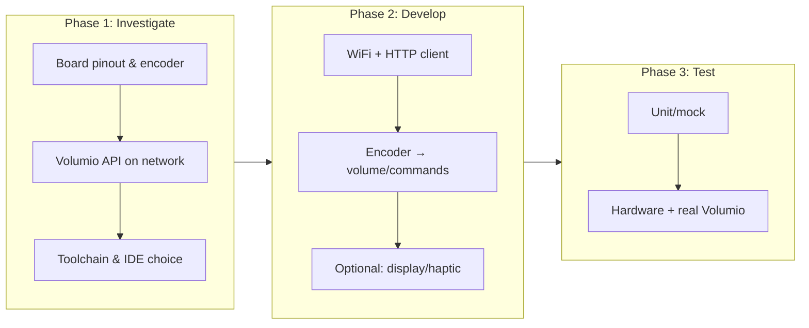
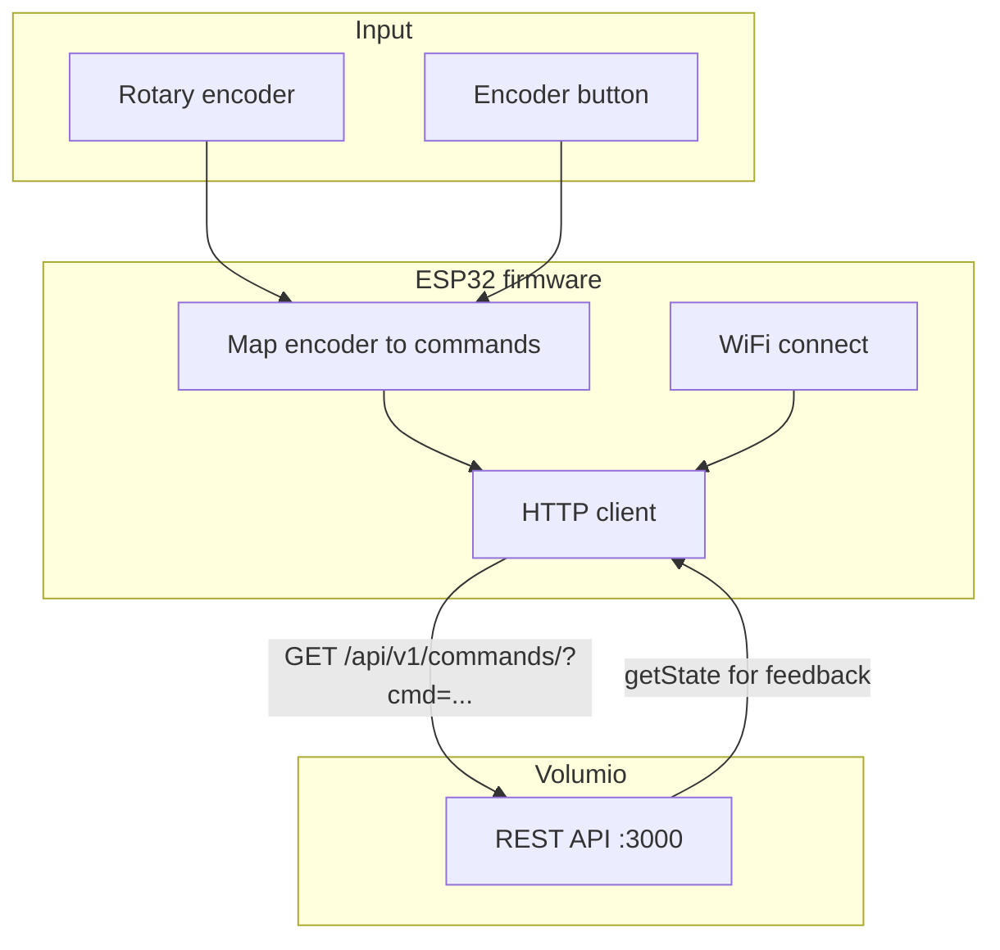
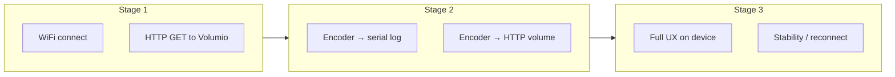
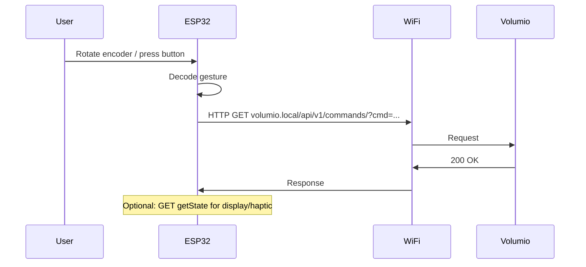

# ESP32 as Volumio Remote — Investigation & Plan

**Goal:** Use this ESP32-based board as a wireless volume (and playback) remote for a Volumio server on the local network — WiFi or Bluetooth as available.

---

## 1. Hardware summary (known)

| Component | Description |
|-----------|-------------|
| **ESP32-S3R8** | Wi-Fi + Bluetooth SoC, 240 MHz, 8 MB PSRAM |
| **ESP32-U4WDH** | Wi-Fi + Classic Bluetooth, 240 MHz, 4 MB Flash |
| **PCM5100A** | Stereo DAC (I²S) — audio out on device |
| **Dual encoder** | One for ESP32-S3, one for ESP32 — ideal for volume/track |
| **USB to UART** | Flashing and serial debug |
| **16 MB Flash** | Plenty for firmware |
| **DRV2605** | Vibration motor driver (I2C) — haptic feedback |
| **TF card, MIC, 3.5 mm jack, Type-C** | Extra features; not required for remote |

**Connectivity:** Board has **Wi-Fi and Bluetooth** on both SoCs. For “remote to Volumio on network,” **Wi-Fi is the right choice**; Volumio is a network player and is controlled over HTTP/WebSocket on the LAN.

---

## 2. What is known vs what needs research

### Known

- **Volumio control:** REST API on port 3000 (or via `volumio.local`). Commands include:
  - `GET /api/v1/getState` — current state (volume, track, play/pause)
  - `GET /api/v1/commands/?cmd=volume&volume=plus|minus|mute|unmute|<0–100>`
  - `GET /api/v1/commands/?cmd=play|pause|toggle|stop|prev|next`
- **Board:** ESP32-S3 + second ESP32, dual rotary encoder, Wi-Fi, USB, 16 MB Flash.
- **ESP32 development:** Arduino (C++) or ESP-IDF (C); PlatformIO/VS Code or Arduino IDE.

### To research

- Exact **pinout** of the dual encoder (which GPIOs, common vs separate for S3 vs U4WDH).
- Which **MCU drives the encoder** you want to use (S3 vs U4WDH) and how the board switches between them (CH445P, Type-C orientation).
- **Volumio hostname/IP** on your network (fixed IP vs mDNS `volumio.local`).
- Whether you want **WebSocket** (push state) in addition to REST (simpler: REST only first).

---

## 3. High-level steps (investigation → develop → test)

---

## 4. Detailed investigation steps

1. **Identify board model and docs**  
   Find the exact product name (e.g. “ESP32-S3 + ESP32 dual encoder dev board”) and manufacturer. Search for schematic, pinout, or “encoder GPIO” in PDF/docs.

2. **Encoder wiring**  
   From schematic or silkscreen:
   - Which GPIOs: CLK, DT, SW (button) for each encoder.
   - Which MCU each encoder is connected to (S3 vs U4WDH).
   - Whether both encoders can be used from one firmware (e.g. only S3).

3. **Volumio reachability**  
   - From a PC on same network: `ping volumio.local` or open `http://volumio.local:3000`.
   - Test: `curl "http://volumio.local/api/v1/getState"` and `curl "http://volumio.local/api/v1/commands/?cmd=volume&volume=plus"`.
   - Note if you use fixed IP (e.g. `192.168.1.22`) or mDNS; ESP32 can use either.

4. **Toolchain choice**  
   - **Arduino (C++)** + Arduino IDE or PlatformIO: faster to start, many examples (WiFi, HTTP, encoder).
   - **ESP-IDF (C)** + VS Code/CLion: more control, smaller binary; steeper learning curve.
   - Recommendation: start with **Arduino + PlatformIO** (or Arduino IDE 2.x) for speed; move to ESP-IDF only if you need it.

5. **Build/flash/debug path**  
   - Install ESP32 board support (Arduino or ESP-IDF).
   - Connect board via Type-C; identify USB-UART port; put board in download mode (BOOT button + power-on if required).
   - Flash a “blink” or “WiFi scan” sketch to confirm toolchain and USB.

---

## 5. Development flow (software)

**Suggested mapping (to be refined):**

- Encoder rotate CW → `volume=plus` (or next track, configurable).
- Encoder rotate CCW → `volume=minus` (or prev track).
- Encoder button → `toggle` (play/pause) or mute.

Optional later: small display (I2C/SPI) showing volume/now-playing from `getState`; DRV2605 haptic on button press.

---

## 6. Toolchain, language, IDE

| Aspect | Option A (recommended to start) | Option B |
|--------|----------------------------------|----------|
| **Framework** | Arduino (ESP32 core) | ESP-IDF |
| **Language** | C++ | C |
| **IDE** | VS Code + PlatformIO, or Arduino IDE 2.x | VS Code + ESP-IDF extension, or CLion |
| **Board package** | “esp32” by Espressif (Arduino) | ESP-IDF v5.x |
| **Key libraries** | `WiFi`, `HTTPClient`, encoder (e.g. `ESP32Encoder` or rotary library) | `esp_wifi`, `esp_http_client`, driver for GPIO/encoder |

**Rough install steps (Arduino + PlatformIO):**

1. Install [PlatformIO](https://platformio.org/) (VS Code extension or standalone).
2. New project → Board: “ESP32-S3 Dev Module” (or exact board if listed); Framework: Arduino.
3. Add libraries: WiFi (built-in), HTTPClient (built-in), encoder library from Library Manager.
4. Configure `platformio.ini`: correct board, upload port, 8MB PSRAM if needed.

---

## 7. Testing strategy

| Stage | What | How |
|-------|------|-----|
| **1** | Network + API | Connect ESP32 to WiFi; call `getState` and `volume&volume=plus` from code; check serial output and actual Volumio behavior. |
| **2** | Encoder → Volumio | Read encoder in loop; send volume/play-pause commands via HTTP; verify on Volumio and optionally with serial logs. |
| **3** | Integration | Power from battery/USB; test at distance; WiFi reconnect after sleep; optional display/haptic. |

**Without hardware:** Mock Volumio with a simple HTTP server (e.g. Python `http.server` or Flask) that prints received `GET /api/v1/commands/?cmd=...` and returns fake `getState` JSON; run on same LAN and point ESP32 to that IP.

---

## 8. Mermaid — end-to-end flow

---

## 9. Rough timeline and effort

| Phase | Tasks | Time (rough) | Effort |
|-------|--------|--------------|--------|
| **Investigate** | Find board docs; pinout; test Volumio API from PC; choose Arduino vs ESP-IDF; get one blink/WiFi sketch running | 0.5–1 day | Low–medium |
| **Prototype** | WiFi + HTTP to Volumio (getState + volume); then add encoder → commands | 1–2 days | Medium |
| **Integrate** | Map all actions; debounce; optional display/haptic; power/battery | 0.5–1 day | Medium |
| **Test & tune** | Range, reconnect, UX; mock server if needed | 0.5–1 day | Low–medium |

**Total rough estimate:** **3–5 days** (assuming a few hours per day and no major board or Volumio surprises).

Blockers that could add time: no schematic (reverse‑engineering pins), Volumio not on same network or behind strict firewall, or needing to move to ESP-IDF for a specific hardware feature.

---

## 10. References

- **Volumio REST API:** [developers.volumio.com — Rest API](https://developers.volumio.com/api/rest-api)  
  Key: `volumio.local/api/v1/commands/?cmd=volume&volume=plus|minus|mute|unmute|<0–100>`, `getState`, `play`, `pause`, `toggle`, `prev`, `next`.
- **ESP32 Arduino:** [ESP32 Arduino core](https://github.com/espressif/arduino-esp32)  
- **ESP-IDF:** [ESP-IDF Programming Guide](https://docs.espressif.com/projects/esp-idf/en/stable/esp32/)  
- **Board:** Pinout/schematic from vendor or product page (to be filled when you have the exact model).

---

## 11. Next actions

1. Identify exact board name and get pinout (encoder GPIOs and which MCU).
2. On a PC: verify `http://volumio.local/api/v1/getState` and one `commands/?cmd=volume&volume=plus`.
3. Create a PlatformIO (or Arduino) project; run WiFi + HTTP client to Volumio.
4. Wire encoder in code to HTTP commands; test on device with real Volumio.

Once the board and Volumio are confirmed, the rest is straightforward firmware work (WiFi, HTTP, encoder handling).
