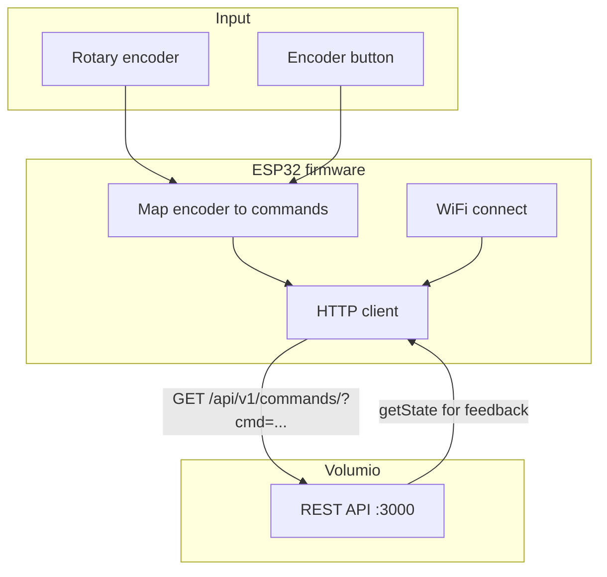
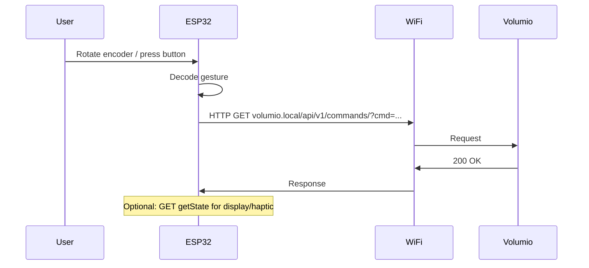

# ESP32 as Volumio Remote — Investigation & Plan

**Goal:** Use this ESP32-based board as a wireless volume (and playback) remote for a Volumio server on the local network — WiFi or Bluetooth as available.

---

## Development setup (Python)

Per repo convention (see [utils/README.md](../README.md)): each util sub-project has its own virtualenv in an `env` directory, git-ignored. For esp32 (e.g. volctrl):

```bash
cd esp32
python3 -m venv env
echo env >> .gitignore   # if not already ignored
source env/bin/activate
pip install volctrl/requirements.txt
python -m volctrl discover
```

---

## Progress summary

| Item | Status |
|------|--------|
| **Research complete** | ~70% |
| **Board identified** | Waveshare ESP32-S3-Knob-Touch-LCD-1.8 (dual MCU: ESP32-S3R8 + ESP32-U4WDH) |
| **Dev methodology** | Attach via Type-C USB; iterate with Arduino or ESP-IDF; no simulator needed |
| **Upload** | Type-C orientation selects which MCU is connected; ESP32-S3: hold BOOT, power on for download mode; flash via esptool or IDE |
| **Encoder GPIOs** | In schematic/demo source (04_Encoder_Test); community hw-reference available |
| **Volumio API** | Documented; not yet tested from this machine |

**Next steps:** (1) Download [schematic](https://files.waveshare.com/wiki/ESP32-S3-Knob-Touch-LCD-1.8/ESP32-S3-Knob-Touch-LCD-1.8-schematic.zip) and confirm encoder GPIOs for S3. (2) On a PC: verify `http://volumio.local/api/v1/getState` and one `commands/?cmd=volume&volume=plus`. (3) Create PlatformIO project; WiFi + HTTP client to Volumio. (4) Wire encoder to HTTP commands on device.

---

## 1. Hardware summary (known)

| Component | Description |
|-----------|-------------|
| **ESP32-S3R8** | Wi-Fi + Bluetooth SoC, 240 MHz, 8 MB PSRAM |
| **ESP32-U4WDH** | Wi-Fi + Classic Bluetooth, 240 MHz, 4 MB Flash |
| **PCM5100A** | Stereo DAC (I²S) — audio out on device |
| **Rotary encoder** | One physical knob; encoder inputs on both MCUs, Type-C orientation selects which MCU sees it |
| **USB to UART** | Flashing and serial debug |
| **16 MB Flash** | Plenty for firmware |
| **DRV2605** | Vibration motor driver (I2C) — haptic feedback |
| **TF card, MIC, 3.5 mm jack, Type-C** | Extra features; not required for remote |
| **Display** | 1.8" IPS 360×360, QSPI, driver ST77916; touch CST816 (I2C) |

**Connectivity:** Board has **Wi-Fi and Bluetooth** on both SoCs. For “remote to Volumio on network,” **Wi-Fi is the right choice**; Volumio is controlled over HTTP/WebSocket on the LAN.

---

## 2. Q/A — Known and from research

### Board and product

- **Q: Exact board?**  
  **A:** Waveshare [ESP32-S3-Knob-Touch-LCD-1.8](https://www.waveshare.com/esp32-s3-knob-touch-lcd-1.8.htm) (product); [Wiki](https://www.waveshare.com/wiki/ESP32-S3-Knob-Touch-LCD-1.8) (setup, demos, schematic, BIN flashing).

- **Q: Development methodology — attach and iterate?**  
  **A:** Yes. Connect via Type-C USB; no simulator. Use Arduino IDE or ESP-IDF (VS Code/CLion). Board appears as COM/serial port; flash with esptool or IDE upload.

- **Q: Easiest way to incorporate Cursor (AI coding agent) into the iteration cycle? CLI tools?**  
  **A:** Work in Cursor with the ESP32 repo open: edit code, ask Cursor to run build/flash/monitor (PlatformIO CLI or `pio run -t upload && pio device monitor`). Cursor can trigger terminal commands (with your approval). No separate “Cursor CLI” for the agent; the loop is: edit in Cursor → run `pio run -t upload` (or Arduino/IDF equivalent) in the integrated terminal → test on device → repeat. Add a rule or short doc in the repo (e.g. “run `pio run -t upload` to flash”) so the agent knows the exact commands.

- **Q: How to attach / upload?**  
  **A:** Type-C plug **orientation** selects which MCU is connected (CH445P switch): one way = ESP32-S3, other = ESP32. For ESP32-S3: hold **BOOT**, power on to enter download mode, then flash. Flashing: esptool (`esptool.py --chip esp32s3 --port COMx write_flash 0x0 firmware.bin`) or Arduino/PlatformIO/ESP-IDF flash button.

- **Q: Do we need a simulator?**  
  **A:** No. Develop on host, flash to device, use serial monitor for debug.

### Volumio API

- **Q: How is Volumio controlled?**  
  **A:** REST API on port 3000 (e.g. `volumio.local`). Key endpoints: `GET /api/v1/getState` (state); `GET /api/v1/commands/?cmd=volume&volume=plus|minus|mute|unmute|<0–100>`; `GET /api/v1/commands/?cmd=play|pause|toggle|stop|prev|next`.

### SoC roles and dual-MCU

- **Q: Why two SoCs?**  
  **A:** S3 handles UI, display (LVGL), encoder; U4WDH adds Classic Bluetooth (S3 has BLE only) and can handle audio/I2S. Split avoids UI stutter while doing wireless/audio.

- **Q: Which MCU drives the encoder?**  
  **A:** There is one knob. Its encoder lines are connected to both MCUs; Type-C orientation selects which MCU is active (and thus which one sees the knob). Demos use **ESP32-S3** (04_Encoder_Test); for our firmware use S3 so the same knob is read by the S3.

- **Q: How does Type-C choose MCU?**  
  **A:** CH445P 4-pole double-throw switch routes USB to either ESP32-S3 or ESP32 depending on plug orientation.

- **Q: Given the S3 handles UI / encoder / WiFi, do we need the other chip? Reasonable to target only the S3 initially?**  
  **A:** For a Volumio remote (WiFi + HTTP + one knob, optional display/haptic) you don’t need the other chip. Target **only the ESP32-S3** initially: it has WiFi, the demos use it for the knob and display, and one firmware keeps the loop simple. The U4WDH is the same single knob when USB is flipped, plus Classic Bluetooth; add it later only if you want BT audio sink or to run a second role on the other MCU.  

### Display and touch (from wiki + community)

- **Q: Display IC and interface?**  
  **A:** ST77916, 360×360, QSPI. Arduino demo pins (S3): CS=14, PCLK=13, DATA0–3=15,16,17,18, RST=21, Backlight=47. Touch: CST816 (I2C).

- **Q: LVGL rotation?**  
  **A:** 180° is fast (pixel reversal in flush). 90°/270° need matrix transpose and are slow on S3; MADCTL (esp_lcd) may allow hardware rotation — worth trying (Reddit).

- **Q: Display colors wrong?**  
  **A:** Panel can be big-endian; LVGL flush may need byte-swap (SH8601/QSPI byte-swap noted in community).

- **Q: LVGL fonts?**  
  **A:** TinyTTF runtime TTF on S3 is problematic (heap/PSRAM). Pre-render bitmap fonts at build with lv_font_conv is recommended.

### Encoder and pins

- **Q: Encoder GPIOs?**  
  **A:** Not listed in wiki text; come from [schematic](https://files.waveshare.com/wiki/ESP32-S3-Knob-Touch-LCD-1.8/ESP32-S3-Knob-Touch-LCD-1.8-schematic.zip) or demo source (04_Encoder_Test). Community hw-reference: [muness/roon-knob docs/esp/hw-reference](https://github.com/muness/roon-knob/tree/master/docs/esp/hw-reference) (CST816, DRV2605, battery ADC, encoder).

### Still to decide / test

- **Volumio hostname/IP** on your network (fixed IP vs mDNS `volumio.local`).
- **WebSocket** (push state) vs REST-only for first version (REST only is simpler).

---

## 3. Sources used

- **Waveshare product:** https://www.waveshare.com/esp32-s3-knob-touch-lcd-1.8.htm  
- **Waveshare Wiki:** https://www.waveshare.com/wiki/ESP32-S3-Knob-Touch-LCD-1.8 (setup, Arduino/ESP-IDF demos, schematic, BIN, FAQ)  
- **Similar project (Roon knob):** https://www.reddit.com/r/esp32/comments/1pt2wnz/lessons_from_an_esp32s3knobtouchlcd18_build_avrcp/ — AVRCP-only hack, LVGL rotation, fonts, hw-reference; [muness/roon-knob](https://github.com/muness/roon-knob)  
- **Tasmota (same hardware):** https://github.com/arendst/Tasmota/discussions/23737 — ST77916 + CST816; display.ini / QSPI pin definitions  
- **ESPHome/HA (similar 1.85"):** https://community.home-assistant.io/t/waveshare-esp32-s3-lcd-1-85/833702 — PSRAM config for LVGL, I2S pins for mic/speaker  

---

## 4. High-level steps (investigation → develop → test)


---

## 5. Detailed investigation steps

1. **Encoder GPIOs** — From schematic or demo: CLK, DT, SW for S3 encoder; confirm which MCU the chosen encoder is on.
2. **Volumio reachability** — From PC: `ping volumio.local`, `curl "http://volumio.local/api/v1/getState"` and `curl "http://volumio.local/api/v1/commands/?cmd=volume&volume=plus"`. Note fixed IP vs mDNS.
3. **Toolchain** — Arduino (ESP32 ≥3.2.0) + PlatformIO or Arduino IDE 2.x recommended to start; ESP-IDF if needed later.
4. **First run** — Flash 04_Encoder_Test or WiFi STA demo; confirm serial and upload path.

---

## 6. Development flow (software)



**Suggested mapping:** Encoder CW → `volume=plus` (or next); CCW → `volume=minus` (or prev); button → `toggle` (play/pause) or mute. Optional later: display (getState), DRV2605 haptic.

---

## 7. Toolchain, language, IDE

| Aspect | Option A (recommended) | Option B |
|--------|------------------------|----------|
| **Framework** | Arduino (ESP32 core ≥3.2.0) | ESP-IDF |
| **Language** | C++ | C |
| **IDE** | VS Code + PlatformIO, or Arduino IDE 2.x | VS Code + ESP-IDF extension |
| **Board** | ESP32-S3 Dev Module (or exact if listed) | ESP-IDF v5.x |
| **Libraries** | WiFi, HTTPClient, encoder (e.g. ESP32Encoder) | esp_wifi, esp_http_client, GPIO/encoder |

---

## 8. Testing strategy

| Stage | What | How |
|-------|------|-----|
| **1** | Network + API | WiFi connect; call getState and volume from code; check serial and Volumio. |
| **2** | Encoder → Volumio | Read encoder; send volume/play-pause via HTTP; verify on Volumio. |
| **3** | Integration | Power, range, reconnect; optional display/haptic. |

**Without hardware:** Mock Volumio with HTTP server returning fake getState and echoing commands.

---

## 9. End-to-end flow



---

## 10. Rough timeline

| Phase | Tasks | Time (rough) |
|-------|--------|---------------|
| **Investigate** | Schematic encoder pins; test Volumio API from PC; toolchain; one blink/WiFi sketch | 0.5–1 day |
| **Prototype** | WiFi + HTTP to Volumio; encoder → commands | 1–2 days |
| **Integrate** | All actions; debounce; optional display/haptic | 0.5–1 day |
| **Test & tune** | Range, reconnect, mock server | 0.5–1 day |

**Total:** ~3–5 days (few hours per day). Blockers: no schematic (reverse-engineering pins), Volumio not reachable, or need for ESP-IDF for a specific feature.

---

## 11. References

- **Volumio REST API:** [developers.volumio.com — Rest API](https://developers.volumio.com/api/rest-api)  
- **ESP32 Arduino:** [ESP32 Arduino core](https://github.com/espressif/arduino-esp32) (≥3.2.0 for this board)  
- **ESP-IDF:** [ESP-IDF Programming Guide](https://docs.espressif.com/projects/esp-idf/en/stable/esp32/)  
- **Waveshare schematic / demo / BIN:** [Wiki Resources](https://www.waveshare.com/wiki/ESP32-S3-Knob-Touch-LCD-1.8) (schematic, demo zip, BIN zip)  
- **Roon-knob hw-reference (encoder, DRV2605, etc.):** [muness/roon-knob docs/esp/hw-reference](https://github.com/muness/roon-knob/tree/master/docs/esp/hw-reference)  

---

## 12. Next actions

1. Get encoder GPIOs from schematic or 04_Encoder_Test demo source.  
2. On PC: verify `http://volumio.local/api/v1/getState` and one `commands/?cmd=volume&volume=plus`.  
3. Create PlatformIO (or Arduino) project; WiFi + HTTP client to Volumio.  
4. Map encoder to HTTP commands; test on device with real Volumio.
