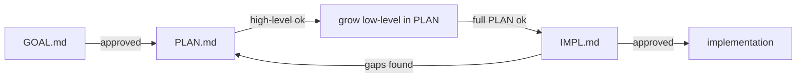

# Project Lifecycle

Guide a project directory through three durable documents plus a shared task
stack. Balance waterfall clarity with agile iteration: documents are
authoritative, but non-blocking curiosities may stay loose in doc body.

## Related skills

| When | Use |
|------|-----|
| Pausing / resuming mid-task | `bookmark-management` |
| Project-specific agent rules | `create-rule` |
| Splitting finished work into PRs | `split-to-prs` |
| Keeping a PR merge-ready | `babysit` |

Templates: [templates.md](templates.md).

---

## Project layout

Ask the user for the **project directory** (any path). Repo setup (`git init`,
etc.) is the user's concern, not this skill's.

```
<project>/
├── GOAL.md
├── PLAN.md              # one file; grows high-level then low-level
├── IMPL.md
├── TODOs.md
├── DONE.md              # finished todos, summary only
├── BOOKMARK.md          # optional; see bookmark-management
└── transcript.txt       # optional; single append-only log
```

Create lifecycle files in order: GOAL, PLAN, IMPL, TODOs, DONE. Keep each
file's **header block** current (see templates).

---

## Phase model



| Phase | Document | Default leadership | Altitude |
|-------|----------|-------------------|----------|
| Intent | `GOAL.md` | **User-led** | What and why |
| Design | `PLAN.md` | **Balanced** | High: systems design; low: tech stack nailed down |
| Specification | `IMPL.md` | **Agent-led** | Five experts would build similar systems |

Leadership is negotiated per project. Record in each header
(`leadership: user | balanced | agent`).

### User-facing language

Users need not know the approval graph. Treat as equivalent:

- "Can we move on to low-level details?" -> high-level `PLAN.md` accepted
- "Looks good, let's implement" -> full `PLAN.md` accepted; start `IMPL.md`
- "I approve the goal" -> `GOAL.md` approved

Confirm when ambiguous.

---

## One `PLAN.md`, two altitudes

Single file. Sections may meld over time; **growth order** is:

1. **High-level** - FAANG systems-design altitude: components, flows, failure
   modes, **technology choices with why** (Kafka vs SQS, DuckDB vs FoundationDB).
   Mermaid diagrams most useful here.
2. **Low-level** - languages, libraries, frameworks, modules, interfaces,
   deployment. Five domain experts should build very similar systems.

Delineate clearly in the file (e.g. `## High-level design` / `## Low-level
design`). Track altitude in the header:

```yaml
plan-altitude: high    # high | low | complete
```

**Approval is implicit** via conversation, not separate approval todos for high
vs low. When the user moves on to low-level detail, treat high-level as accepted
and set `plan-altitude: low`. When ready for `IMPL.md`, set
`plan-altitude: complete` and `status: approved`.

---

## Open questions: todo vs doc

| Kind | Where |
|------|-------|
| Blocks dependency path / approval / design choice | `# Pn.` todo in `TODOs.md` |
| Curiosity, care-later, non-blocking | loose bullets in `GOAL.md` / `PLAN.md` body |

---

## Initial `TODOs.md`

Seed three tasks (P0..P2). Insert in priority order:

```markdown
# P0. Approve GOAL.md
# P1. Approve PLAN.md      ## Preconditions: Approved GOAL.md
# P2. Approve IMPL.md      ## Preconditions: Approved PLAN.md
```

---

## `GOAL.md` workflow

1. Scaffold from template; `status: draft`, `leadership: user`.
2. Prompt user to hand-edit `GOAL.md`.
3. Ask: follow user's structure as-is, or massage into clearer structure?
4. Default: **follow user**.
5. Verify: propose corner cases not yet covered.
   - Blocking gaps -> todo
   - Non-blocking -> `## Open questions` in doc
6. Log key exchanges in `transcript.txt` (see [Transcript](#transcript)).
7. On approval: `status: approved`, record approver + date; move todo to `DONE.md`.

---

## `PLAN.md` workflow

1. Ask who drafts first. Default **balanced**: agent one-page bulleted high-level draft.
2. Grow **high-level** section first; iterate with user.
3. When user accepts high-level (explicitly or "move to low-level"), set
   `plan-altitude: low`; grow **low-level** section in the same file.
4. Use `TODOs.md` for spikes and blocking design questions.
5. On full acceptance: `status: approved`, `plan-altitude: complete`; move todo to `DONE.md`.

---

## `IMPL.md` workflow

1. Default **agent-led** unless negotiated.
2. Restate low-level `PLAN.md`: pseudo-code, interaction diagrams, enumerated
   states and lifetimes for major objects.
3. When enumeration exposes flaws:
   - **P0 todo** at top: revise `IMPL.md` at gap
   - Todo to **update `PLAN.md`**
   - `status: blocked-on-plan` until resolved
4. On approval: `status: approved`; move todo to `DONE.md`.
5. Keep `IMPL.md` current as implementation proceeds.

---

## `TODOs.md` conventions

State file: loose stack + light bookmark (**Next** section).

### Structure (top to bottom)

1. **Header** - `state: PLAN draft high | resumed 2026-06-20`
2. **Next** - single pointer; sync with `BOOKMARK.md` when present
3. **Active todos** - `# Pn. summary`; newest toward top within priority band

No Done section here - use `DONE.md`.

### Todo format

```markdown
# P1. Choose message queue

lockedby: agent-a7f3
lockeduntil: 2026-06-20T15:40:00Z

## Preconditions
- Approved GOAL.md
- High-level PLAN accepted

- Compare Kafka vs SQS
- Record in PLAN.md technology table
```

- **Priority**: P0 (urgent) .. P5 (least); insert sorted.
- **Body**: short bullets.
- **Preconditions**: `##` major gates; `###` small nested ones.
- **Large precondition**: own `# Pn.` task above dependant; reference by name.
- **Small precondition**: nest under `###`.

### Locks

```
lockedby: <agent-id>
lockeduntil: <ISO-8601 UTC>
```

- Stable agent id per session (e.g. `agent-<short-random>`).
- **Estimate `lockeduntil` from task size: ~20 min light, up to ~2 h heavy.**
- On completion: remove todo and lock fields.
- If lock expired and not yours: ask before taking over.

### Finishing a todo

1. Remove from `TODOs.md`.
2. Append **one brief line** to `DONE.md` (summary only):

```markdown
- Approve GOAL.md
- Choose message queue: SQS, documented in PLAN
```

No nested arrow chains in `DONE.md`; save detail in canonical docs or
`transcript.txt`.

---

## Bookmarks

See **`bookmark-management`** skill. Do not duplicate that protocol here.

---

## Transcript

Single file: `transcript.txt`. Append-only.

- **Continuous work**: flow entries without timestamps every line.
- **Gap > ~1 session day**: prefix a datestamp line, then continue.

```
2026-06-18
user approved high-level PLAN; agent starting low-level section

user: prefer Rust for the worker
agent: noted in PLAN low-level, open question on WASM edge deferred to doc
```

---

## Ongoing maintenance

- Update `TODOs.md` when phase, altitude, or active task changes.
- Sync headers in GOAL / PLAN / IMPL with decisions and leadership.
- Reconcile `IMPL.md` when implementation diverges.

---

## Kickoff checklist

1. Confirm project directory path.
2. Write scaffolds from [templates.md](templates.md).
3. Seed `TODOs.md` (three approval todos); create empty `DONE.md`.
4. Open conversation on `GOAL.md`; negotiate leadership.
5. Record leadership in headers before drafting `PLAN.md`.
