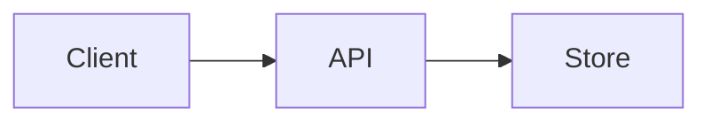

# Project lifecycle templates

## GOAL.md header

```markdown
---
status: draft          # draft | approved | superseded
leadership: user       # user | balanced | agent
approved-by:
approved-on:
---

# Goal

## Problem

## Users and stakeholders

## Success criteria

## Constraints

## Non-goals

## Open questions
```

Non-blocking curiosities live under **Open questions**. Blocking items become todos.

## PLAN.md header

```markdown
---
status: draft          # draft | approved
plan-altitude: high    # high | low | complete
leadership: balanced
approved-by:
approved-on:
---

# Plan

## High-level design

Summary bullets. Mermaid here when useful.



### Technology choices

| Decision | Choice | Why | Alternatives considered |

### Components and flows

### Failure modes and operations

## Low-level design

Grow after high-level is accepted (implicit or explicit).

### Languages and frameworks

### Modules and interfaces

### Deployment shape

## Open questions
```

Sections may meld; keep **High-level** vs **Low-level** headings legible.

## IMPL.md header

```markdown
---
status: draft          # draft | blocked-on-plan | approved
leadership: agent
approved-by:
approved-on:
---

# Implementation specification

## Module map

## State machines

## Lifetimes

## Pseudo-code

## Interaction diagrams

## Deviations from PLAN
```

## TODOs.md skeleton

```markdown
# TODOs

state: GOAL draft

## Next

- P0 Approve GOAL.md

---

# P0. Approve GOAL.md

## Preconditions
- (none)

# P1. Approve PLAN.md

## Preconditions
- Approved GOAL.md

# P2. Approve IMPL.md

## Preconditions
- Approved PLAN.md
```

## DONE.md skeleton

```markdown
# Done

Brief summaries only; one line per finished todo.
```

## transcript.txt

```
2026-06-20
user chose user-led GOAL; agent to follow structure as-is

user approved GOAL offline mode deferred to PLAN
```
