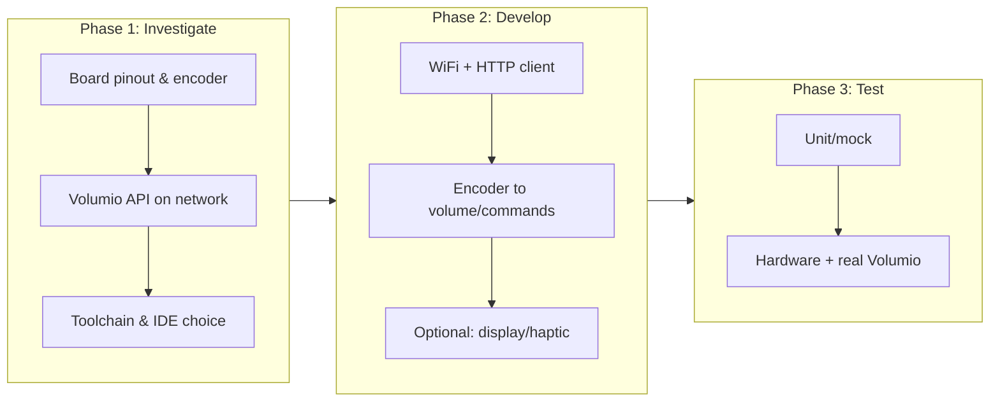
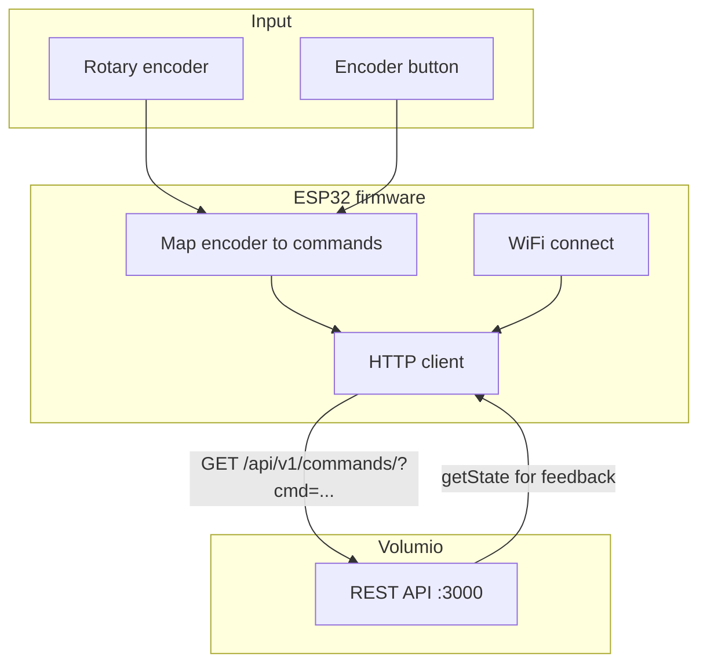
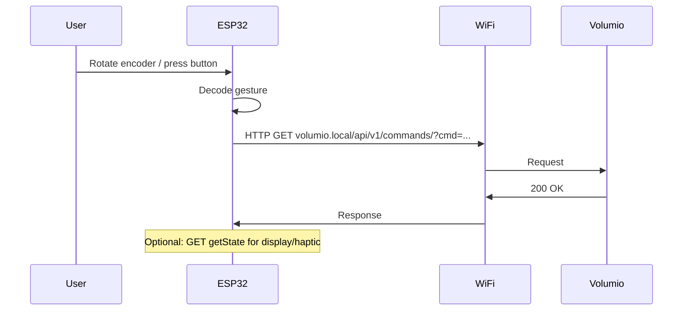

# ESP32 as Volumio Remote — Investigation & Plan

**Goal:** Use this ESP32-based board as a wireless volume (and playback) remote for a Volumio server on the local network — WiFi or Bluetooth as available.

---

Python / Cursor agent notes: [`AGENTS.md`](AGENTS.md) (venv conventions also in
root [`AGENTS.md`](../AGENTS.md)).

## Research docs (2026-09-07)

| Doc | Topic |
|-----|-------|
| [`docs/hardware-identity.md`](docs/hardware-identity.md) | Exact SKU + USB/flash evidence |
| [`docs/usb-enumerate-2026-09-07.md`](docs/usb-enumerate-2026-09-07.md) | Raw USB / esptool capture |
| [`docs/frameworks-ota.md`](docs/frameworks-ota.md) | OTA-capable stacks vs MicroPython |
| [`docs/display-touch.md`](docs/display-touch.md) | Round panel / 240x240 / LVGL stack |

## Progress summary

| Item | Status |
|------|--------|
| **Board identified** | **CORRECTED 2026-09-07:** Elecrow CrowPanel 1.28inch-HMI ESP32 Rotary Display, SKU **DHE38128D** (flash string `ESP32S3_1.28_BLE_Server`). Earlier Waveshare 1.8 dual-MCU ID was wrong for the attached unit. |
| **OTA / frameworks** | Documented: prefer Arduino/PlatformIO (+ OTA partition table); MicroPython not factory default. |
| **Display / touch** | Documented: GC9A01 240x240 square FB in round bezel; LVGL over LovyanGFX; CST816D touch; encoder GPIOs on wiki. |
| **Volumio API** | Documented; not yet tested from this machine |

**Next steps:** (1) PlatformIO Arduino project with OTA-ready partitions for DHE38128D. (2) Verify Volumio HTTP from host. (3) Encoder + optional LVGL volume UI to Volumio commands.

---

## 1. Hardware summary (known)

| Component | Description |
|-----------|-------------|
| **ESP32-S3R8** | Wi-Fi + BLE SoC, 240 MHz, 8 MB PSRAM, 16 MB flash |
| **Display** | 1.28" round IPS; square **240x240** FB; driver **GC9A01** (SPI) |
| **Touch** | Capacitive **CST816D** (I2C) |
| **Rotary encoder** | Knob A/B/SW (GPIOs 45/42/41 per Elecrow wiki) |
| **Ambient LEDs** | WS2812 ring (5 LEDs on GPIO 48) |
| **USB** | Native USB-Serial/JTAG (`0x303a:0x1001`) |

**Connectivity:** Wi-Fi for Volumio HTTP/WebSocket on the LAN; BLE available on S3 but not required for the remote.

---

## 2. Q/A — Known and from research

### Board and product

- **Q: Exact board?**  
  **A:** **CORRECTED 2026-09-07:** Elecrow [CrowPanel 1.28inch-HMI ESP32 Rotary Display](https://www.elecrow.com/crowpanel-1-28inch-hmi-esp32-rotary-display-240-240-ips-round-touch-knob-screen.html) (SKU **DHE38128D**); [Wiki](https://elecrow.com/wiki/CrowPanel_1.28inch-HMI_ESP32_Rotary_Display.html). Evidence: `docs/hardware-identity.md`. (Older Waveshare answers below in dual-MCU sections are historical mis-ID.)

- **Q: Development methodology — attach and iterate?**  
  **A:** Yes. Connect via Type-C USB; no simulator. Prefer Arduino IDE or PlatformIO; ESP-IDF also fine. Board appears as `/dev/cu.usbmodem*` (Espressif USB JTAG/serial); flash with esptool or IDE upload.

- **Q: How to attach / upload?**  
  **A:** Single ESP32-S3 with native USB-Serial/JTAG. Hold **BOOT** while resetting if download mode is needed; usually `esptool` resets via USB. Example: `esptool --chip esp32s3 --port /dev/cu.usbmodem1101 write_flash ...` or PlatformIO upload.

- **Q: Do we need a simulator?**  
  **A:** No. Develop on host, flash to device, use serial monitor for debug.

### Volumio API

- **Q: How is Volumio controlled?**  
  **A:** REST API on port 3000 (e.g. `volumio.local`). Key endpoints: `GET /api/v1/getState` (state); `GET /api/v1/commands/?cmd=volume&volume=plus|minus|mute|unmute|<0–100>`; `GET /api/v1/commands/?cmd=play|pause|toggle|stop|prev|next`.

### SoC roles (CrowPanel is single-MCU)

- **Q: Dual MCU / Type-C flip?**  
  **A:** **Not on this board.** Those notes were for a mis-identified Waveshare product. CrowPanel DHE38128D is a single ESP32-S3R8.  

### Display and touch

- **Q: Display IC and interface?**  
  **A:** **CORRECTED:** GC9A01 SPI, 240x240 square framebuffer in a round bezel. Pins (wiki): SCLK=10, MOSI=11, DC=3, CS=9, RST=14, backlight=46. Touch: CST816D I2C (SDA=6, SCL=7, INT=5, RST=13). See `docs/display-touch.md`.

- **Q: Widgets or pixels?**  
  **A:** LVGL widgets on top of LovyanGFX (or Arduino_GFX). Not a proprietary closed UI OS; factory firmware already uses LVGL.

- **Q: Circular vs square?**  
  **A:** Optics are circular; addressing is square 240x240. Design UI inside the inscribed circle or accept clipped corners.

### Encoder and pins

- **Q: Encoder GPIOs?**  
  **A:** Elecrow wiki: A=45, B=42, SW=41. WS2812 ambient LEDs on GPIO 48 (5 LEDs).

### Still to decide / test

- **Volumio hostname/IP** on your network (fixed IP vs mDNS `volumio.local`).
- **WebSocket** (push state) vs REST-only for first version (REST only is simpler).
- First custom firmware with OTA-ready partition table (factory image has single `app0` only).

---

## 3. Sources used

- **Waveshare product:** https://www.waveshare.com/esp32-s3-knob-touch-lcd-1.8.htm  
- **Waveshare Wiki:** https://www.waveshare.com/wiki/ESP32-S3-Knob-Touch-LCD-1.8 (setup, Arduino/ESP-IDF demos, schematic, BIN, FAQ)  
- **Similar project (Roon knob):** https://www.reddit.com/r/esp32/comments/1pt2wnz/lessons_from_an_esp32s3knobtouchlcd18_build_avrcp/ — AVRCP-only hack, LVGL rotation, fonts, hw-reference; [muness/roon-knob](https://github.com/muness/roon-knob)  
- **Tasmota (same hardware):** https://github.com/arendst/Tasmota/discussions/23737 — ST77916 + CST816; display.ini / QSPI pin definitions  
- **ESPHome/HA (similar 1.85"):** https://community.home-assistant.io/t/waveshare-esp32-s3-lcd-1-85/833702 — PSRAM config for LVGL, I2S pins for mic/speaker  

---

## 4. High-level steps (investigation → develop → test)

---

## 5. Detailed investigation steps

1. **Encoder GPIOs** — From schematic or demo: CLK, DT, SW for S3 encoder; confirm which MCU the chosen encoder is on.
2. **Volumio reachability** — From PC: `ping volumio.local`, `curl "http://volumio.local/api/v1/getState"` and `curl "http://volumio.local/api/v1/commands/?cmd=volume&volume=plus"`. Note fixed IP vs mDNS.
3. **Toolchain** — Arduino (ESP32 ≥3.2.0) + PlatformIO or Arduino IDE 2.x recommended to start; ESP-IDF if needed later.
4. **First run** — Flash 04_Encoder_Test or WiFi STA demo; confirm serial and upload path.

---

## 6. Development flow (software)

**Suggested mapping:** Encoder CW → `volume=plus` (or next); CCW → `volume=minus` (or prev); button → `toggle` (play/pause) or mute. Optional later: display (getState), DRV2605 haptic.

---

## 7. Toolchain, language, IDE

| Aspect | Option A (recommended) | Option B |
|--------|------------------------|----------|
| **Framework** | Arduino (ESP32 core ≥3.2.0) | ESP-IDF |
| **Language** | C++ | C |
| **IDE** | VS Code + PlatformIO, or Arduino IDE 2.x | VS Code + ESP-IDF extension |
| **Board** | ESP32-S3 Dev Module (or exact if listed) | ESP-IDF v5.x |
| **Libraries** | WiFi, HTTPClient, encoder (e.g. ESP32Encoder) | esp_wifi, esp_http_client, GPIO/encoder |

---

## 8. Testing strategy

| Stage | What | How |
|-------|------|-----|
| **1** | Network + API | WiFi connect; call getState and volume from code; check serial and Volumio. |
| **2** | Encoder → Volumio | Read encoder; send volume/play-pause via HTTP; verify on Volumio. |
| **3** | Integration | Power, range, reconnect; optional display/haptic. |

**Without hardware:** Mock Volumio with HTTP server returning fake getState and echoing commands.

---

## 9. End-to-end flow

---

## 10. Rough timeline

| Phase | Tasks | Time (rough) |
|-------|--------|---------------|
| **Investigate** | Schematic encoder pins; test Volumio API from PC; toolchain; one blink/WiFi sketch | 0.5–1 day |
| **Prototype** | WiFi + HTTP to Volumio; encoder → commands | 1–2 days |
| **Integrate** | All actions; debounce; optional display/haptic | 0.5–1 day |
| **Test & tune** | Range, reconnect, mock server | 0.5–1 day |

**Total:** ~3–5 days (few hours per day). Blockers: no schematic (reverse-engineering pins), Volumio not reachable, or need for ESP-IDF for a specific feature.

---

## 11. References

- **Volumio REST API:** [developers.volumio.com — Rest API](https://developers.volumio.com/api/rest-api)  
- **ESP32 Arduino:** [ESP32 Arduino core](https://github.com/espressif/arduino-esp32) (≥3.2.0 for this board)  
- **ESP-IDF:** [ESP-IDF Programming Guide](https://docs.espressif.com/projects/esp-idf/en/stable/esp32/)  
- **Waveshare schematic / demo / BIN:** [Wiki Resources](https://www.waveshare.com/wiki/ESP32-S3-Knob-Touch-LCD-1.8) (schematic, demo zip, BIN zip)  
- **Roon-knob hw-reference (encoder, DRV2605, etc.):** [muness/roon-knob docs/esp/hw-reference](https://github.com/muness/roon-knob/tree/master/docs/esp/hw-reference)  

---

## 12. Next actions

1. Get encoder GPIOs from schematic or 04_Encoder_Test demo source.  
2. On PC: verify `http://volumio.local/api/v1/getState` and one `commands/?cmd=volume&volume=plus`.  
3. Create PlatformIO (or Arduino) project; WiFi + HTTP client to Volumio.  
4. Map encoder to HTTP commands; test on device with real Volumio.
