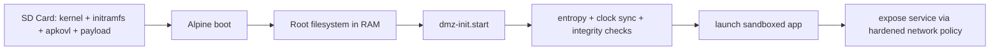
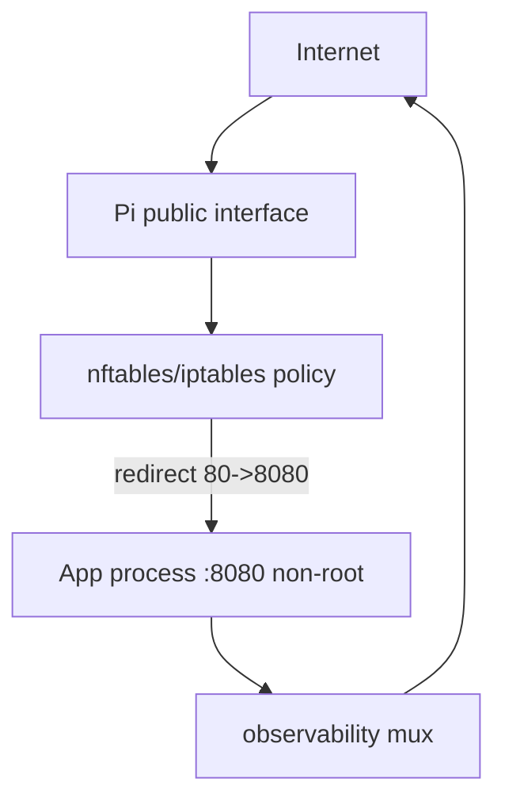
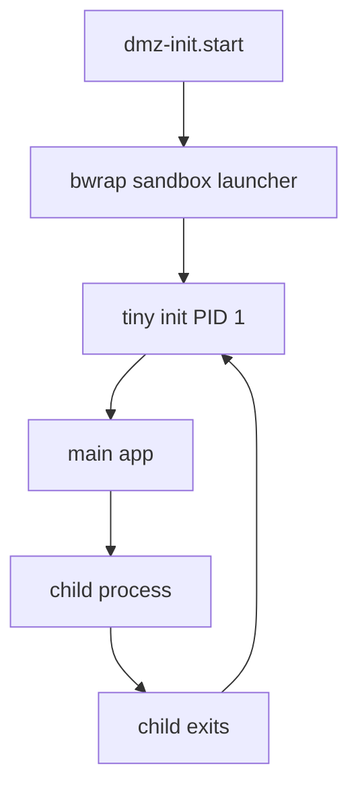
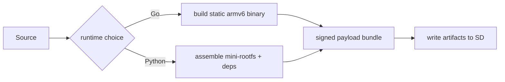
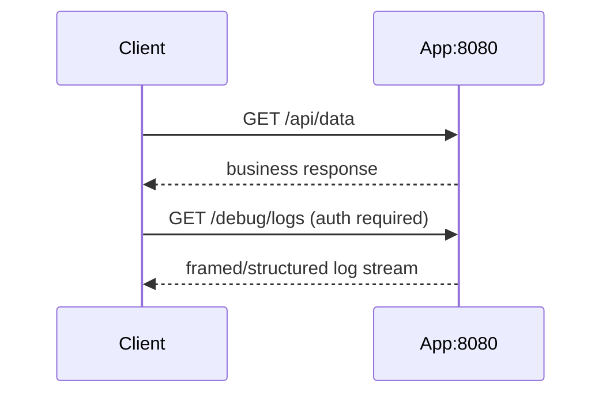
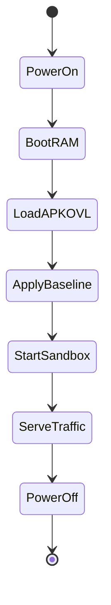
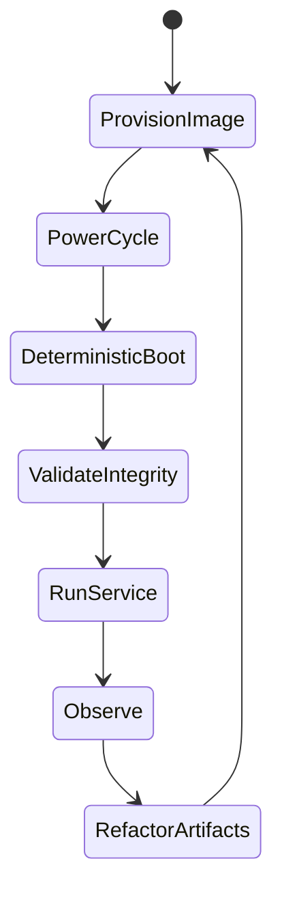
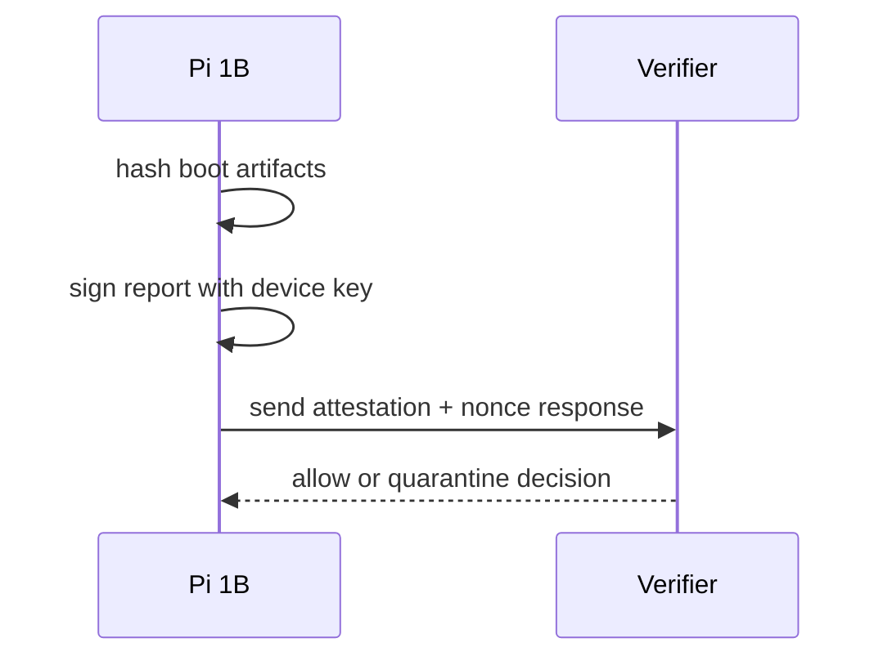

# PiSec: Internet-Exposed Raspberry Pi 1B Hardening Guide

This document expands the architecture and operating model for legacy Raspberry Pi 1B deployments exposed directly to the Internet (no NAT protection), with emphasis on reproducibility, minimal attack surface, and rapid recovery.

## High-Level Scope

- Host OS Provisioning: Alpine Linux diskless (RAM boot) setup.
- Network Architecture: Port redirection (`80 -> 8080`) and interface hardening.
- Sandbox Engine: Replace Docker with `bwrap` (Bubblewrap) for ARMv6 compatibility.
- Payload Preparation: Cross-compile Go static binaries vs bundling Python in mini-rootfs.
- Exfiltration & Observability: Unified I/O for logs and app data over one exposed port.
- Persistence Loop: Use `.apkovl` to store intentional, immutable configuration.
- Development Workflow: "Flash-Boot-Test-Refactor" as the standard deployment cycle.
- Optional Extension: Remote attestation / integrity assurance.

## 1) Host OS Provisioning: Alpine Diskless (RAM Boot)

### Objective
Boot from known-good artifacts and keep runtime state in RAM so every power cycle resembles a factory reset.

### Security Posture
- SD card stores boot artifacts and declared configuration only.
- Root filesystem lives in RAM and is recreated at boot.
- Runtime drift is discarded on reboot.

### Recommended Controls
- Minimize installed packages (no compiler toolchain on target).
- Disable unused services and interactive admin paths where possible.
- Keep startup scripts deterministic and checksummed.

## 2) Network Architecture: Redirect + Interface Hardening

### Objective
Expose one public entry point while keeping the application unprivileged internally.

### Pattern
- Public ingress on `:80`.
- Local redirect to app process on `:8080`.
- App runs as non-root.

### Hardening Baseline
- Default DROP inbound; allow only explicit service ports.
- Restrict outbound traffic to essentials (DNS/NTP/telemetry).
- Apply connection/rate limiting to reduce brute-force and scanning impact.

## 3) Sandbox Engine: Bubblewrap for ARMv6

### Objective
Contain application execution without Docker daemon overhead or ARMv7+ assumptions.

### Why Bubblewrap
- Works on constrained systems.
- Lightweight namespace/filesystem isolation.
- No resident container daemon.

### Critical Runtime Detail
Use a tiny init (`tini` or `dumb-init`) as PID 1 in the sandbox to reap children and prevent zombie buildup.

## 4) Payload Preparation: Go Static vs Python Mini-RootFS

### Objective
Produce architecture-correct payloads that run reliably on Pi 1B (ARMv6-class).

### Go Path (Preferred)
- Cross-compile static binary:
  - `GOOS=linux`
  - `GOARCH=arm`
  - `GOARM=6`
  - `CGO_ENABLED=0`
- Verify artifact architecture before release.

### Python Path (When Required)
- Bundle interpreter + dependencies in mini-rootfs.
- Ensure dependency wheels and binary extensions are ARMv6-compatible.
- Avoid pulling generic ARMv7+/aarch64 packages.

## 5) Exfiltration & Observability: Unified I/O on Single Port

### Objective
Keep one exposed port while preserving separation between user traffic and operator diagnostics.

### Core Risk
If app traffic and logs share one socket with no framing, traffic classes blur and leak risk increases.

### Pattern
- Route normal traffic through application endpoints (for example `/api/*`).
- Gate diagnostics with explicit auth and framing (for example `/debug/logs`).
- Redact sensitive fields before log emission.
- Keep bounded in-memory log windows to avoid memory exhaustion.

## 6) Persistence Loop: `.apkovl` as Immutable Intent

### Objective
Persist only what you intentionally declare; reset everything else each boot.

### What Belongs in `.apkovl`
- Startup scripts and launch policy.
- Network/firewall baseline.
- Trusted keys and integrity metadata.
- Minimal runtime configuration.

### Security Consequence
Compromise without SD modification is non-persistent across reboot.

## 7) Development Workflow: Flash -> Boot -> Test -> Refactor

### Objective
Eliminate "pet server" drift by making redeployments the only mutation path.

### Workflow
1. Build payload + configuration artifacts.
2. Flash/update SD artifacts.
3. Boot and run acceptance checks.
4. Capture telemetry and failures.
5. Refactor and repeat.

### Benefit
Highly reproducible recovery and lower chance of hidden manual config changes.

## Difficulties You Are Not Foreseeing (And Practical Mitigations)

### A) Single-Port Log Conflict
- **Problem:** User traffic and system logs collide on one port.
- **Mitigation:** Protocol-level multiplexing with explicit endpoint boundaries and auth.

### B) ARMv6 Instruction Set Gap
- **Problem:** ARMv7/v8 binaries crash with `Illegal instruction` on Pi 1B.
- **Mitigation:** Strict `GOARM=6` and architecture verification in CI/release checks.

### C) Entropy Starvation
- **Problem:** TLS/keygen can block at boot with low entropy.
- **Mitigation:** Seed entropy early (`haveged` or `rng-tools`) before TLS-dependent services.

### D) Clock Drift (TLS Killer)
- **Problem:** No RTC means invalid system time after cold boot.
- **Mitigation:** Time sync gate (for example `ntpdate`/`chrony`) before app startup.

### E) Zombie Process Accumulation
- **Problem:** No proper PID 1 reaping in minimalist sandbox.
- **Mitigation:** Use `tini`/`dumb-init` as sandbox entrypoint.

## High-Level Operating Model: Pi as a State Machine

- SD card is the "ROM" (declared artifacts).
- RAM is the "register set" (ephemeral execution state).
- Deployment equals a controlled "factory reset."

This model intentionally avoids "SSH in and fix live" as an operational norm.

## 8) Remote Attestation (Recommended Addition)

For Pi 1B, full TPM-backed measured boot is typically unavailable, but practical integrity assurance is still possible.

### Pragmatic Attestation Pattern
- Compute boot-time hashes of kernel/initramfs/`.apkovl`/payload.
- Sign and send an integrity report to a verifier service.
- Include nonce/timestamp to prevent replay.
- Quarantine if measured hashes diverge from expected baseline.

### Decision
Yes: add this section. It closes a key trust gap for unattended Internet-exposed nodes.

