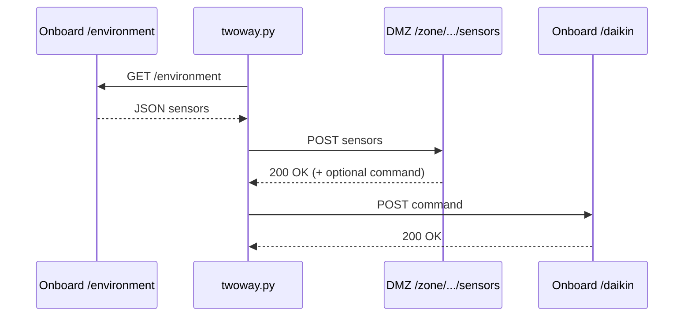

Home Thermostat IR with Raspberry Pi and Anavi IR hat
=====================================================

(Preminimary before moving this to separate repo)

### TL;DR

I have a daikin heat-pump minisplit, but it does not provide any room for automation unless you get
a hardwired control panel. Which I won't, being bit by the previous daikin installer. So I have the
IR remotes.

I also have a raspberry pi zero W and an anavi IR pi hat with temperature sensor. 

So let's pull them together and see what we get. 

## Architecture diagrams

### High-level flow

```mermaid
flowchart LR
  user[User / automation] --> dmz[DMZ API]
  dmz --> onboard[Onboard API]
  onboard --> irtx[IR TX (GPIO)]
  irtx --> headunit[Daikin head unit]
  onboard --> i2c[I2C bus /dev/i2c-1]
  i2c --> htu[HTU21D temp/humidity]
```

### Twoway relay



### Onboard I2C flow

```mermaid
flowchart TD
  app[Flask app] -->|/environment| htu[HTU21D singleton]
  htu --> bus{is_test_env?}
  bus -->|false| smbus[smbus.SMBus(1)]
  bus -->|true| fake[smbus_fake.SMBus(1)]
```

# Ingredients

This is very flexible, so you can almost certainly get the same results with any variations. But
here's my recipe

1. `Raspberry pi zero W` SBC. We need the GPIO headers for the hat. But other than that we should be
   ok. I tried this initially with a `MangoPI MQ Quad`, but the operating system felt... sketchy and
   the GPIO headers were apparently not readily addressable [1]. I might revisit the mango, which is
   quite cheap for the next room.

   We will run a web / REST server on the SBC; nothing very fancy, but the PCB will need to run
   python and git for our needs.

2. The [`ANAVI Infrared pHAT`](https://anavi.technology/#products) (scroll down). 

3. A suitable IR target.  For me: the daikin MiniSplit.


# Prep


1. Get a headless distro on the SBC. You'll want to configure `wpa supplicant` for your wifi and install the i2c packages    
   a. Get I2C `apt-get install i2c-tools`
   b. Turn on I2C `sudo raspi-config`
      Select Interfacing Options > I2CInterfacing Options > I2C and enable it.
      (from memory, this was one thing that was non-trivial for the mango)
   c. get I2C workign on python. There are like 3 different standards, and the defacto default choice 
      when anavi's docs were written has subsequently gone unmaintained. 
      They suggest some variation of 
      `apt-get install python-dev python-rpi.gpio wiringpi` 
      I'll have to check to see what I did exactly. 

   
