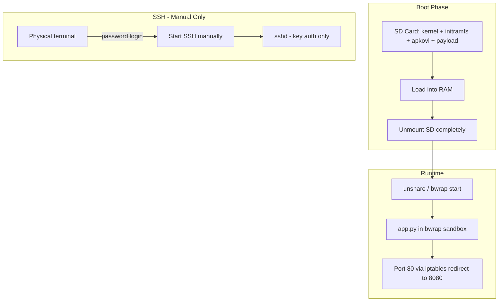
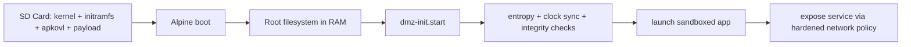
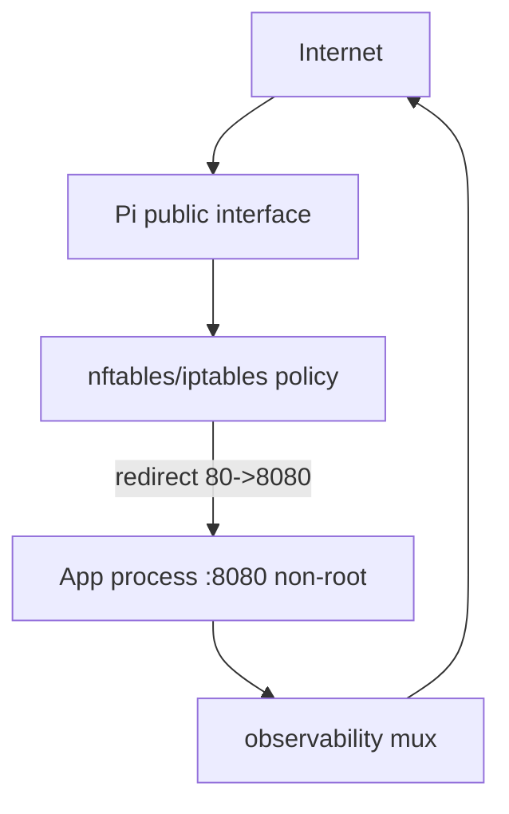
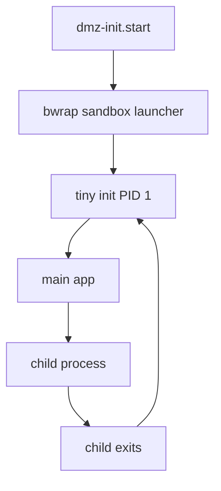
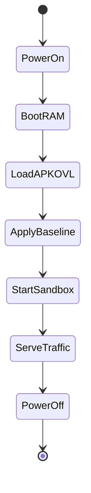
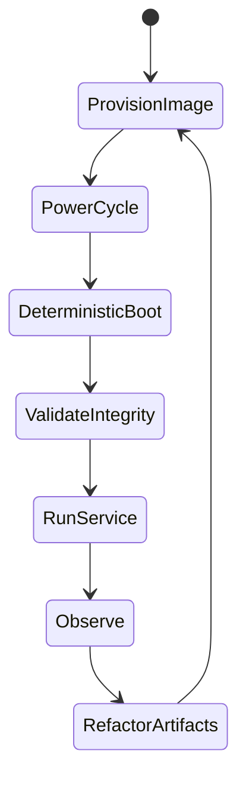

# DMZ Pi 1B Development Plan

Roadmap to securely host `app.py` on a Raspberry Pi 1B exposed to the open internet. Target: Alpine Linux diskless, bwrap sandbox, no durable writable storage, RO ramdisk, SD unmount after boot, SSH manual/key-only.

## Target Architecture

## Boot Flow

## Network Architecture

## Sandbox Engine (bwrap + tini)

## Persistence Loop

## Development Workflow: Flash -> Boot -> Test -> Refactor

---

## Phases

### Phase 1: Host Provisioning

- Alpine Linux diskless setup
- SD layout: kernel, initramfs, apkovl, payload
- Boot into RAM; root filesystem in RAM
- Minimize installed packages (no compiler on target)
- See Alpine docs for armv6/raspberrypi

### Phase 2: SD Unmount

- After payload load and unshare/bwrap start, unmount SD completely
- `umount /media/mmcblk0p1` (or equivalent) in dmz-init.start
- Runtime has no access to SD; all state in RAM

### Phase 3: dmz-init.start

OpenRC script (`/etc/local.d/dmz-init.start`) does:

1. Entropy: `haveged` or `rng-tools` before TLS-dependent services
2. Clock sync: `ntpdate` or `chrony` before app startup
3. iptables: `modprobe iptable_nat`; redirect 80→8080
4. Create unprivileged user: `adduser -D -s /bin/sh dmzuser`
5. Extract rootfs: `mkdir -p /tmp/dmz_rootfs && tar -xf /media/mmcblk0p1/dmz_rootfs.tar -C /tmp/dmz_rootfs`
6. Launch: `su dmzuser -c "./install/run_raw.sh /tmp/dmz_rootfs" &`
7. Unmount SD: `umount /media/mmcblk0p1` (or appropriate path)

### Phase 4: bwrap / tini

- Add `tini` (or dumb-init) as PID 1 in sandbox to reap zombies
- Update Dockerfile: `apk add tini`; use tini as entrypoint
- Update run_raw.sh to exec tini with app as child

### Phase 5: SSH Hardening

- `rc-update del ssh` — SSH not started at boot
- Start manually from physical console when needed: `rc-service sshd start`
- `PasswordAuthentication no` for sshd
- `AuthorizedKeysFile` only; no password over SSH
- Console: password login allowed (physical terminal)
- Optional: `ListenAddress` to internal interface if dual-homed

### Phase 6: Install Scripts

- `export_rootfs.sh` — Docker image → rootfs tarball (keep)
- `run_raw.sh` — bwrap launcher (keep, update for tini)
- `prepare-sd.sh` — Copy dmz_rootfs.tar + install/ to SD mount (add)
- `dmz-init.start` — Template for apkovl (add)
- Order: prepare → flash → boot → test

### Phase 7: Observability

- `/debug/logs` endpoint (auth required) for bounded in-memory log stream
- Entropy and clock sync in dmz-init (Phase 3)
- Optional: remote syslog (`-R <logserver>:514`)

### Phase 8: Machine Auth (twoway → DMZ)

- **Ed25519 request signing**: Twoway signs each POST to `/zone/<name>/sensors` with its private key; DMZ verifies with public key.
- **Payload**: `method + path + timestamp + body_hash` (SHA256 of raw body).
- **Headers**: `X-Zone-Signature`, `X-Zone-Timestamp`, `X-Zone-Name`.
- **Replay protection**: Timestamp must be within ±5 min.
- **Keys**: `ZONE_PRIVATE_KEY` / `ZONE_PRIVATE_KEY_PATH` in twoway; `ZONE_PUBLIC_KEY` / `ZONE_PUBLIC_KEY_PATH` in DMZ.
- **Optional**: When keys not set, zone endpoints accept unsigned requests (backwards compat).

---

## Mitigations

| Risk | Mitigation |
|------|------------|
| **ARMv6 gap** | Build with `--platform linux/arm/v6`; verify no ARMv7+ instructions |
| **Entropy starvation** | `haveged` or `rng-tools` in dmz-init before app |
| **Clock drift** | `ntpdate`/`chrony` in dmz-init before app (TLS certs need valid time) |
| **Zombie processes** | `tini` or `dumb-init` as PID 1 in sandbox |
| **Single-port log conflict** | Explicit `/debug/logs` endpoint with auth; bounded buffer |

---

## Order of Operations (Prepare → Flash → Boot → Test)

1. **Dev machine**: Build image, export rootfs, run `prepare-sd.sh`
2. **SD card**: Mount on dev machine; copy payload + install scripts
3. **Pi**: Boot Alpine; dmz-init runs automatically (or run steps manually for debug)
4. **Verify**: `curl http://<pi-ip>/zones` or hit app endpoints
