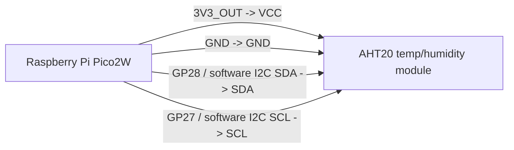
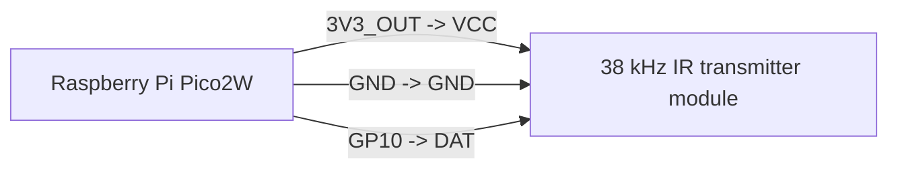

# Pico2W Thermostat Controller -- Design Plan

## Overview

The Raspberry Pi Pico2W replaces the Pi Zero2W as the embedded zone controller.
It runs a single binary that combines the roles of `app` (IR transmit, sensor read)
and `twoway` (DMZ polling loop) that currently run as separate processes on the Pi.

WiFi target: SSID `lumiere` (house network). No Docker, no Flask, no Linux.

## Hardware

Initial hardware target:

- Controller: Raspberry Pi Pico2W.
- IR kit: Dorhea 4Pcs Digital 38khz Ir Receiver Sensor Module + 4Pcs
  38khz Ir Transmitter Sensor Module Kit for Electronic Building Block.
- IR wiring model: each IR module is three-wire: `VCC`, `DAT`/`OUT`, `GND`.
  Use Pico GPIO for the signal line. Confirm module voltage behavior before
  tying any 5 V-powered `DAT`/`OUT` line directly to a Pico input.
- Temperature/humidity sensor: I2C AHT20/ATH20 module. Use Pico I2C `SDA`,
  `SCL`, `VCC`, and `GND`.
- Reviewed 2026-06-15 from `hat/pico-side.vox`: AHT20 `SDA` routes to GP28
  and AHT20 `SCL` routes to GP27, using firmware software I2C because that pair
  is not a shared RP2350 hardware I2C controller pair. IR TX module `DAT`
  routes to GP10, and IR RX module `OUT` routes to GP13. Power modules from
  `3V3_OUT` unless the IR module is verified safe for 5 V with level shifting.
- Verified 2026-05-31: MicroPython on the Pico2W scanned the AHT20 at `0x38`
  on I2C0 (`SDA` GP4, `SCL` GP5). That breadboard wiring proved the sensor,
  but the Pico-side HAT routing above is now the firmware default.
- Status LED: onboard LED labeled `LEDW`, driven through the CYW43 WiFi chip
  rather than a normal RP2350 GPIO. LEDW is single-color, so the yellow, blue,
  green, and red status names are rendered as distinct blink patterns.

### Wiring Sketch



---



---


---

## Observable Behavior

### Startup

1. Power on.
2. Blink status LED with the yellow pattern while reading the compiled/env
   configuration.
3. Initialize the CYW43439 WiFi chip (SPI bus, load firmware blob).
4. Connect to SSID `lumiere` using stored credentials. Blink LED at 1 Hz while
   associating; solid LED on successful DHCP lease.
5. Load Ed25519 private key from flash (compiled in or stored in last flash sector).
6. Enter the main poll loop.

### Status LED Contract

- 1 pulse: happy path marker that a DMZ poll has started.
- 2 pulses: sending an IR command.
- 3 pulses: startup/configuration.
- 4 pulses: real error paths, such as required sensor failure,
  network errors, signing errors, parse errors, or IR transmit failures.
  Missing AHT20 hardware with `SENSOR_BOOT_REQUIRED=0` is a fallback reading,
  not a red/error status.

### Zone Health

The Pico2W firmware owns a bounded rolling log buffer. `GET /healthz` on the
default onboard app port (`5000`) returns basic firmware health and that log
buffer. The buffer keeps 64 entries and returns up to 32 newest-first entries;
there is no file log on the Pico.

During bring-up, USB CDC serial is the primary debug path. It mirrors the same
rolling health log before WiFi and DHCP are available, so developers can see
`wifi join start`, `wifi join failed`, `wifi wait dhcp`, and
`wifi and dhcp ready` without soldering a UART or SWD header. Treat `/healthz`
as a verification step only after the serial log proves WiFi and DHCP are up.

### Main Poll Loop

```
LOOP:
  sensors  <- read_sensors()          # fake until hardware attached
  body     <- build_post_body(sensors, last_applied_command)
  sig_hdrs <- sign_ed25519(body, priv_key, zone_name, path)
  response <- POST http://jovlinger.duckdns.org:5000/zone/<zone>/sensors
              headers: Content-Type: application/json
                       X-Zone-Signature: <base64 Ed25519 sig>
                       X-Zone-Timestamp: <unix epoch seconds>
                       X-Zone-Name:      <zone_name>
              timeout: POST_TIMEOUT_SECONDS (default 600)
  if response == timeout or network error:
    blink_status(RED)
    wait POST_RETRY_SECS (default 5, exponential backoff to 60)
    GOTO LOOP
  if response.status != 200:
    blink_status(RED)
    log_error(response.status)
    wait POST_RETRY_SECS
    GOTO LOOP
  zone_state <- parse_json(response.body)
  cmd        <- zone_state["command"]      # may be null
  if cmd != null AND cmd["created_dt"] > last_applied_created_dt:
    blink_status(BLUE)
    transmit_ir(cmd)
    last_applied_created_dt <- cmd["created_dt"]
  blink_status(GREEN)
  GOTO LOOP
```

The DMZ long-polls on its side (up to LONG_POLL_TIMEOUT_SECS = 60 s default)
before returning the zone state. The pico's POST_TIMEOUT_SECONDS must comfortably
exceed that margin. The pico therefore blocks in the POST for up to ~70 s normally
and up to 600 s at the hard cap.

### Accurate Sensors With Optional Boot

The selected hardware profile uses the AHT20/ATH20 temperature/humidity sensor
for production readings. During bring-up, missing sensor hardware is not a boot
failure when `SENSOR_BOOT_REQUIRED=0`; the firmware logs the read failure and
uses fallback values for that poll:

- `temp_centigrade`: 1.0 (fixed)
- `humid_percent`: 1.0 (fixed)
- IR transmit: drive the GP10 IR LED for accepted Midea commands and log
  "IR sent command".

Once the sensor and IR hardware are attached, set `SENSOR_BOOT_REQUIRED=1` to
fail fast on a missing AHT20.

### Office Midea IR Reference

The Office remote capture in `thermo/scribble/captures` matches the
Coolix / Midea24-style byte-complement protocol, not IRremoteESP8266's native
`IRMideaAC` checksum protocol.

References to keep with the implementation work:

- IRremoteESP8266 `ir_Coolix`: byte plus inverse encoding, 4.4 ms header,
  560 us mark, 1.6 ms / 560 us spaces, and about a 5.2 ms packet gap:
  <https://github.com/crankyoldgit/IRremoteESP8266/blob/master/src/ir_Coolix.cpp>
- IRremoteESP8266 `sendMidea24`: describes this as a 48-bit NEC-like form with
  alternate inverted bytes and 24 bits of real data:
  <https://github.com/crankyoldgit/IRremoteESP8266/blob/master/src/ir_Midea.cpp>
- Standalone `esp-midea-ir` encoder: same `B2 xx yy` data packet expanded with
  complement bytes:
  <https://github.com/sheinz/esp-midea-ir/blob/master/midea-ir.c>

Current Office evidence: each normal command sends the complement-paired state
packet twice, then a third 48-bit `D5 ...` packet after the same roughly 5.2 ms
gap. Example power-on sequence: `B2 4D 9F 60 60 9F`,
`B2 4D 9F 60 60 9F`, then `D5 28 20 01 00 1E`. The existing transmitter only
sends the first two packets, so the third packet is the likely missing piece.

---

## POST Body Format

Identical to what `twoway.py` sends to `POST /zone/<zone>/sensors`.

```json
{
  "sensors": {
    "temp_centigrade": 21.0,
    "humid_percent": 50.0
  },
  "command": {
    "power": false,
    "mode": "AUTO",
    "temp_c": 20,
    "half_c": 40,
    "fan": "AUTO",
    "swing": false,
    "powerful": false,
    "econo": false,
    "comfort": false,
    "timer_on_minutes": null,
    "timer_off_minutes": null,
    "timer_on_active": false,
    "timer_off_active": false,
    "created_dt": "2026-05-25T10:00:00.000000"
  },
  "deployment": {
    "hardware_profile": "pico2w",
    "zone_name": "<zone>"
  }
}
```

The `command` field is omitted on cold start (no command ever applied). On
subsequent polls it carries the last applied command and its `created_dt` so
DMZ can apply its strictly-newer gate (same logic as in `twoway.py`
`_env_to_dmz_body`).

---

## Auth: Ed25519 Request Signing

CORRECTION from original spec: the POST body is NOT encrypted. It is sent as
plaintext JSON over HTTP. Authentication is provided by Ed25519 request signing,
matching the existing DMZ `zone_auth` protocol.

The signing payload (same as `zone_auth.py` on the Pi):

```
METHOD\nPATH\nTIMESTAMP_EPOCH_INT\nSHA256_HEX_OF_BODY
```

Three HTTP headers carry the proof:
- `X-Zone-Signature`: base64url-encoded Ed25519 signature (64 bytes -> 88 chars)
- `X-Zone-Timestamp`: Unix epoch seconds as decimal string
- `X-Zone-Name`:      zone name string (must match URL path segment)

DMZ rejects requests with clock skew > 300 s. The pico must have NTP-synced
time before the first POST.

The private key (32 raw bytes or PEM PKCS8) is stored in flash. The corresponding
`pub.pem` is already deployed to DMZ (`thermo/config/zone/pub.pem`).

---

## DMZ Response Format

DMZ returns `ZoneState` JSON from `_zone_response()`:

```json
{
  "command": {
    "power": true,
    "mode": "HEAT",
    "temp_c": 22,
    "half_c": 44,
    "fan": "AUTO",
    "swing": false,
    "powerful": false,
    "econo": false,
    "comfort": false,
    "timer_on_minutes": null,
    "timer_off_minutes": null,
    "timer_on_active": false,
    "timer_off_active": false,
    "created_dt": "2026-05-25T10:01:00.000000",
    "last_access_dt": "2026-05-25T10:01:05.000000"
  },
  "sensors": {
    "temp_centigrade": 21.0,
    "humid_percent": 50.0,
    "created_dt": "2026-05-25T10:01:05.000000"
  }
}
```

`command` is `null` when no command has ever been posted to this zone.

---

## "New" Command Detection

CORRECTION from original spec: the response field is not literally the string
"new". The pico must compare `response.command.created_dt` (ISO 8601 string)
against the `created_dt` of the last command it applied. A command is "new" iff
its `created_dt` is lexicographically strictly greater (ISO 8601 sorts correctly
as strings). This is the same gate that `app.py::handle_set_daikin_body` applies.

If `command` is null, skip IR transmit.
If `command.created_dt` is absent, treat as stale (skip).

---

## Hardware Interaction: FreeRTOS + Infineon CYW43439

### The CYW43439

The CYW43439 is Infineon's (formerly Cypress) 802.11 b/g/n + BT5 combo chip.
On the Pico2W it is wired to the RP2040 over SPI (with IRQ and power-enable GPIO).
The chip runs its own firmware blob (loaded from the RP2040 at boot over SPI) and
has an internal MAC/PHY. The RP2040 and the CYW43 communicate via a register
protocol (SDIO-over-SPI at the electrical level). The pico-sdk ships:
- `pico_cyw43_driver`: RP2040-side SPI driver + firmware loader
- `cyw43-driver`: higher-level WiFi association, scan, DHCP glue
- lwIP: full TCP/IP stack integrated with the cyw43 event loop

The CYW43439 must be "pumped" regularly. Without pumping, the chip misses
incoming packets and the WiFi association can drop. There are two pumping modes:

1. Polling mode: call `cyw43_arch_poll()` in a tight loop or timer callback.
2. FreeRTOS mode (`PICO_CYW43_ARCH_FREERTOS`): a dedicated high-priority
   FreeRTOS task (`cyw43_task`) runs the pump on a semaphore. The IRQ from the
   CYW43439 signals the semaphore; the task wakes, calls the SPI driver, and
   feeds packets upward into lwIP. This is the correct model for a multi-task
   application because the WiFi task never blocks the application task.

### FreeRTOS Task Layout

```
Task: cyw43_task          prio HIGH  -- pumps CYW43 events, feeds lwIP
Task: tcp_task            prio HIGH  -- lwIP timers (from pico_sdk integration)
Task: app_task            prio NORM  -- our poll loop: read sensors, POST, IR
Task: blink_task          prio LOW   -- LED heartbeat, visible connectivity state
```

The app_task uses `xTaskNotifyWait` or `vTaskDelay` to sleep between retries
without burning CPU. The HTTP POST blocks on a lwIP socket; during that block
FreeRTOS schedules cyw43_task to keep the WiFi alive.

### Critical Integration Detail

The lwIP/CYW43 integration requires all lwIP API calls from application code to
be wrapped in `cyw43_arch_lwip_begin()` / `cyw43_arch_lwip_end()` (or the
equivalent `LOCK_TCPIP_CORE()` macros) when running with NO_SYS=0 (FreeRTOS
mode). Failure to hold the lock causes corruption of lwIP internal state under
concurrent access from cyw43_task and app_task. Every HTTP open/write/read/close
must happen inside this lock or on the lwIP-dedicated thread.

### Time Sync

The RP2040 has no RTC and no battery. On every boot the pico must SNTP-sync
before signing. Use lwIP's SNTP client; wait for sync before entering the
poll loop. Without a valid timestamp, DMZ rejects all POSTs with 401 (clock
skew > 300 s).

---

## Language Architecture Sketches

Current implementation target: Rust with an Embassy-style async architecture.
The first checked-in scaffold keeps protocol and sensor fallback logic testable
on the host while the embedded WiFi/HTTP/IR drivers are added.

### 1. MicroPython

**Library availability:** Excellent. `urequests`, `ujson`, `uhashlib`, `time`,
`network`, WiFi association -- all in the standard Pico2W MicroPython firmware.
`ucryptolib` provides AES but NOT Ed25519; you must either implement Ed25519 in
pure MicroPython (slow, ~2-5 s per sign), find a C module, or use a pre-shared
HMAC as a stopgap. The `uasyncio` library handles concurrent tasks adequately.

**Robustness:** Moderate. The garbage collector introduces unpredictable pauses
(10-200 ms). WiFi reconnection is well-tested. `urequests` can hang on dropped
connections; wrap every call with a hard timeout via a watchdog or a separate
async task.

**Bugginess:** Low for stdlib paths; moderate for edge cases (SSL, chunked
transfer). Ed25519 absence is the main blocker.

**Observability:** Strong. REPL over USB serial always available. `print()`
statements appear immediately. `uos.dupterm()` can redirect output to UART.
`mpremote` allows file inspection on a live device. WebREPL optionally over WiFi.

**Other -ilities:** Very fast iteration. Deploy a `.py` file in seconds. No
compile step. RAM is tight (~200 KB heap); avoid large string allocations in
the hot loop.

**Core loop:**

```python
import urequests, ujson, network, utime

ZONE = "kitchen"
DMZ  = "http://jovlinger.duckdns.org:5000/zone/{}/sensors".format(ZONE)
POST_TIMEOUT = 600
last_created_dt = ""

def fake_sensors():
    return {"temp_centigrade": 1.0, "humid_percent": 1.0}

async def poll_loop():
    global last_created_dt
    while True:
        body = {"sensors": fake_sensors()}
        hdrs = sign_ed25519(body, ZONE)          # your impl
        try:
            r = urequests.post(DMZ, json=body, headers=hdrs, timeout=POST_TIMEOUT)
            zone = r.json()
            cmd = zone.get("command")
            if cmd and cmd.get("created_dt", "") > last_created_dt:
                transmit_ir(cmd)                 # stub: print for now
                last_created_dt = cmd["created_dt"]
        except Exception as e:
            print("poll error:", e)
            utime.sleep(5)
```

---

### 2. Rust (embassy-rs or rp2040-hal + FreeRTOS-via-C FFI)

**Library availability:** Good and improving rapidly. `embassy-rp` provides async
drivers for the RP2040 including CYW43439 (`cyw43` crate, native async). `reqwless`
or `edge-http` handle HTTP over a `TcpSocket`. `ed25519-dalek` (no-std with
`alloc`) handles signing. NTP: manual SNTP implementation is ~50 lines. JSON: `serde_json`
needs `alloc`; `serde-json-core` works on no-std. The `embassy` executor replaces
FreeRTOS entirely but achieves the same concurrency model.

**Robustness:** Highest of any option. The type system prevents most classes of
memory error and data race at compile time. No GC pauses. Stack sizes are
explicit and checked. Panics are loud (defmt + RTT). WiFi reset after association
loss is handled by the `cyw43` async driver.

**Bugginess:** Low in the core language; moderate in `embassy-rp` (still
pre-1.0, API churn). `reqwless` is functional but not battle-hardened. Expect
occasional embassy-rp commit that moves APIs without deprecation warnings.

**Observability:** `defmt` + `probe-rs` RTT gives structured, zero-allocation
logging over SWD without a UART. `probe-run` or `cargo flash` deploys in
seconds. No interactive REPL; printf-debugging requires recompile. Panic
messages are captured and readable.

**Other -ilities:** Longest initial setup. Tight binary (~100 KB flash). No
heap fragmentation. Compiles to a UF2 file dragged to the device. Strong
long-term maintainability.

**Core loop:**

```rust
#[embassy_executor::task]
async fn poll_loop(stack: &'static Stack<cyw43::NetDriver<'static>>) {
    let mut last_created_dt: heapless::String<64> = heapless::String::new();
    loop {
        let sensors = read_sensors_fake();
        let body    = build_post_body(&sensors, &last_created_dt);
        let sig     = sign_ed25519(&body, PRIV_KEY, ZONE_NAME);
        match http_post(stack, DMZ_URL, &body, &sig).await {
            Ok(response) => {
                if let Some(cmd) = response.command {
                    if cmd.created_dt.as_str() > last_created_dt.as_str() {
                        transmit_ir_stub(&cmd);
                        last_created_dt = cmd.created_dt;
                    }
                }
            }
            Err(e) => {
                defmt::warn!("poll failed: {:?}", e);
                Timer::after_secs(5).await;
            }
        }
    }
}
```

---

### 3. Chibi-Scheme

Chibi-Scheme (Alex Shinn) is a small, embeddable R7RS Scheme -- a true Lisp-1
with proper tail calls, hygienic macros, and a full numeric tower. It is
designed to be linked as a C library into a host application, making it the
most realistic bare-metal Scheme for the RP2350.

**Runtime requirements:**

- Flash: ~120-160 KB for the Chibi object code + standard libraries compiled in.
  The RP2350 (Pico2W) has 4 MB flash; this is comfortable.
- RAM: Chibi's heap is configurable at init time. A 64 KB heap handles our
  workload (JSON strings, a few live objects). 128 KB is conservative headroom.
  The RP2350 has 520 KB SRAM total; after FreeRTOS tasks (~8 KB stacks each),
  lwIP (~40 KB), and cyw43 driver buffers (~48 KB), roughly 300 KB is free for
  the Chibi heap. No pressure.
- Performance: Chibi runs a bytecode VM, roughly 10-30x slower than equivalent
  C for computation. Our hot path is almost entirely sleeping inside the HTTP
  POST (blocking on the network for up to 600 s). The Scheme computation per
  loop (build body, compare strings, decide IR) takes well under 1 ms even at
  interpreter speed. Not a concern.
- GC: Chibi uses a precise incremental mark-sweep GC. Pause times on a 64 KB
  heap are under 1 ms. No issue at our poll rate.

**Library availability:** Good for the core language; thin for peripherals.
WiFi, HTTP, Ed25519, and IR GPIO must be implemented as C foreign functions and
registered with `chibi_define_foreign`. JSON can be written in Scheme (~100
lines) or via a C extension wrapping cJSON. Proper tail calls mean the loop
below works indefinitely without stack growth.

**Robustness:** Moderate-good. Chibi is stable and well-tested on hosted
systems. The embedded bring-up (no filesystem, custom allocator, no POSIX) is
manual work but well-documented. The GC is correct. WiFi and HTTP reliability
depends on the C layer beneath.

**Bugginess:** Low in the interpreter itself; moderate in the integration layer
(the C shim you write). No known RP2350 production deployment to reference.

**Observability:** REPL over UART or USB serial is possible by binding
`chibi_eval` to the serial input loop -- gives live introspection of Scheme
state. `error-object-message` and condition objects surface errors cleanly.
Weaker than MicroPython's built-in tooling; stronger than bare Rust.

**Other -ilities:** Clean separation between the Scheme application logic and
the C hardware layer. Swapping the loop logic requires no recompile of the C
layer. If we ever move back to a Pi, the Scheme code is portable as-is.

**Core loop:**

```scheme
(define (poll-loop last-created-dt)
  (let* ((sensors   (fake-sensors))
         (body      (build-post-body sensors last-created-dt))
         (sig-hdrs  (sign-ed25519 body *zone-name*))
         (response  (http-post *dmz-url* body sig-hdrs *post-timeout*)))
    (if (eq? response 'error)
        (begin (sleep-ms *retry-ms*)
               (poll-loop last-created-dt))
        (let ((cmd (assoc 'command response)))
          (if (and cmd
                   (string>? (cdr (assoc 'created_dt cmd))
                              last-created-dt))
              (begin (transmit-ir cmd)
                     (poll-loop (cdr (assoc 'created_dt cmd))))
              (poll-loop last-created-dt))))))
; proper tail calls -- this runs forever without growing the stack
```

---

### 4. ANSI C (pico-sdk native)

This loop is simple enough that plain C with the pico-sdk is a legitimate
architecture choice, not a fallback. The entire application fits in ~500 lines
of C with no interpreter overhead and no runtime surprises.

**Runtime requirements:**

- Flash: ~60-80 KB for application code + cJSON (~4 KB) + TweetNaCl Ed25519
  (~20 KB). Dominated by the pico-sdk + lwIP + cyw43 firmware loader (~1.5 MB
  combined), which are present in every option.
- RAM: no heap needed beyond lwIP/cyw43 buffers. Two stack-allocated char
  buffers (~4 KB each) for request and response JSON. Total application RAM
  under 16 KB above the driver baseline.
- Performance: near-optimal. Ed25519 sign in C (TweetNaCl): ~10 ms on RP2350
  at 150 MHz. JSON parse (jsmn, zero-alloc): under 1 ms. No GC, no interpreter.

**Library availability:** Best of any option. pico-sdk, lwIP, FreeRTOS, cJSON,
jsmn, TweetNaCl -- all mature, well-documented C libraries with RP2040/RP2350
examples.

**Robustness:** Highest for the application logic. The type system is weaker
than Rust but the code surface is small enough to audit by hand. No GC pauses,
no interpreter bugs, no FFI boundary issues.

**Bugginess:** Buffer overflows are possible (use snprintf, check lengths).
Otherwise very low risk for a loop this simple.

**Observability:** `printf` over UART or USB CDC. No REPL. For richer logging,
add a small ring buffer and expose it over a second HTTP endpoint (requires a
second FreeRTOS task). `probe-rs` + OpenOCD give hardware breakpoints and
memory inspection over SWD.

**Other -ilities:** Easiest to onboard any C developer. No toolchain beyond the
pico-sdk CMake build. UF2 drag-and-drop deploy. Smallest binary; leaves the
most flash for future features.

**Core loop:**

```c
static void poll_loop(void) {
    char last_created_dt[64] = {0};
    char body_buf[1024];
    char resp_buf[2048];

    for (;;) {
        build_post_body(body_buf, sizeof(body_buf),
                        fake_temp(), fake_humid(), last_created_dt);
        SignatureHeaders sig = sign_ed25519(body_buf, ZONE_NAME);

        int ok = http_post(DMZ_URL, body_buf, &sig,
                           POST_TIMEOUT_S, resp_buf, sizeof(resp_buf));
        if (!ok) { vTaskDelay(pdMS_TO_TICKS(RETRY_MS)); continue; }

        const char *created_dt = json_get_str(resp_buf, "command.created_dt");
        if (created_dt && strcmp(created_dt, last_created_dt) > 0) {
            transmit_ir_stub(resp_buf);
            strncpy(last_created_dt, created_dt, sizeof(last_created_dt) - 1);
        }
    }
}
```

---

### 5. MicroCC on-device C JIT

Goal: research MicroCC as the on-device C compiler path while Rust remains the
active firmware implementation. MicroCC claims a self-hosting C compiler for
Cortex-M microcontrollers that runs on Raspberry Pi Pico, compiles C to ARM
Thumb machine code, and executes the compiled code from SRAM.

**Runtime requirements:** The MicroCC README reports a 64 KB GC heap, about a
26 KB UF2 including compiler, REPL, and samples, and ~10 ms compile time on the
133 MHz RP2040 Cortex-M0+. That is plausibly small enough for Pico 2 W class
hardware, but must be remeasured with the CYW43/WiFi stack, HTTP, Ed25519, JSON,
sensor drivers, source storage, generated code, and app state all present.

**Target fit:** MicroCC targets ARM Thumb-1 for Cortex-M0+. Pico 2 W's RP2350
Arm cores are Cortex-M33, so Thumb-1-style generated code should be a plausible
subset when running the Arm cores, but this still needs hardware validation.
Confirm SRAM execution, function-pointer Thumb bit handling, cache/barrier
requirements, and any TrustZone/MPU execute restrictions in the chosen boot
configuration.

**Library availability:** MicroCC provides the compiler and JIT codegen. Hardware
access should still come from a fixed native firmware layer, not arbitrary C
includes. The JIT C sees a narrow `thermo_host.h` API for WiFi, HTTP, AHT20
sensor reads, IR send/receive, Ed25519 signing, time, logging, and flash storage.

**Robustness:** Experimental but better aligned than TinyCC for this idea
because MicroCC is already aimed at Pico-class Cortex-M JIT execution. Keep a
known-good compiled fallback loop in the base firmware so a bad C source update
or boot compile failure cannot brick the unit.

**Bugginess:** Unknown. The public repository is small and appears early-stage.
The highest-risk areas are C subset limits, ABI drift between `thermo_host.h`
and the firmware host layer, generated code bounds, and memory pressure once the
real network stack is linked.

**Observability:** Strong during compile if the base firmware exposes MicroCC
diagnostics over USB serial. Runtime debugging is weaker than Rust unless the
JIT stores symbol names and source line mappings.

**Other -ilities:** The research deployment unit becomes `.c`/`.h` source copied
into flash, with no host compile step for application logic. This is attractive
for fast field changes if the compiler footprint, C subset, and failure
isolation are acceptable.

**Boot model:**

```c
/* Stored in flash as thermo_app.c and compiled by MicroCC at boot. */
#include "thermo_host.h"

int thermo_app_poll_once(const ThermoHost *host, ThermoState *state) {
    ThermoSensors sensors;
    if (host->read_aht20(&sensors) != 0) {
        sensors.temp_centigrade = 1.0f;
        sensors.humid_percent = 1.0f;
    }
    return host->post_sensors_and_apply_command(&sensors, state);
}
```

---

### 6. uLisp

**Library availability:** uLisp (David Johnson-Davies) is a Lisp interpreter
that runs on ARM Cortex-M (Arduino-compatible boards) including RP2040. There is
a Pico-specific build. It has: GPIO, I2C, SPI, timers, and WiFi via the pico-sdk
bindings (CYW43 association, TCP sockets). JSON must be implemented in Lisp or
via a thin C extension. Ed25519 requires a C extension (uLisp supports foreign
function calls).

**Robustness:** Low to moderate. uLisp is a single-threaded interpreter; there
is no preemption. A blocking socket call blocks everything. WiFi reconnection
must be explicit. The interpreter is small (~10 KB) but error recovery is
minimal (the default error handler resets to the REPL).

**Bugginess:** Moderate. The RP2040 WiFi uLisp port is recent and
less tested than the ESP32 port. uLisp has no formal test suite for the network
layer.

**Observability:** The REPL over USB serial is the primary debugging interface.
You can inspect and redefine functions live without rebooting -- this is uLisp's
main advantage. `format` and `print` go to the serial REPL. No RTT, no
structured logs.

**Other -ilities:** Fastest "change one function and test" cycle of any option
(REPL-driven). Terrible for production: no watchdog integration, no OTA, no
structured concurrency.

**Core loop:**

```lisp
(defun poll-loop (last-created-dt)
  (let* ((sensors  (fake-sensors))
         (body     (build-post-body sensors last-created-dt))
         (sig-hdrs (sign-ed25519 body *zone-name*))
         (response (http-post *dmz-url* body sig-hdrs *post-timeout*)))
    (if (eq response :error)
        (progn (delay (* *retry-secs* 1000))
               (poll-loop last-created-dt))
        (let ((cmd (cdr (assoc :command response))))
          (if (and cmd
                   (string> (cdr (assoc :created_dt cmd))
                             last-created-dt))
              (progn (transmit-ir cmd)
                     (poll-loop (cdr (assoc :created_dt cmd))))
              (poll-loop last-created-dt))))))
```

---

### 7. Forth (Zeptoforth)

**Chosen Forth:** zeptoforth (Travis Bemann, MIT license). Targets RP2040
natively. Has: multitasking (cooperative and preemptive), GPIO, I2C, SPI, UART,
flash storage, and an active pico2w WiFi branch (CYW43439 via SPI + lwIP). This
is the most complete RP2040 Forth available.

**Library availability:** Good for low-level; thin at the application layer.
JSON must be written from scratch (feasible: ~100 lines of Forth). Ed25519 must
be implemented or ported from another Forth (secp256k1 work exists; Ed25519 is
more unusual -- expect 200-400 lines of tight Forth for the field arithmetic).
HTTP is available via the lwIP bindings in the WiFi branch.

**Robustness:** Moderate. Forth is fast (near-C speed) and predictable. No GC.
Stack discipline errors cause silent data corruption -- the type safety burden is
entirely on the programmer. zeptoforth's preemptive multitasking handles WiFi
pump and app loop correctly when configured.

**Bugginess:** Moderate. The zeptoforth WiFi/CYW43 layer is newer and has fewer
users than the MicroPython equivalent. Bugs in CYW43 initialization and
reassociation have been reported and fixed irregularly. Expect some debugging
of the WiFi bring-up path.

**Observability:** Interactive Forth console over USB or UART. You can call any
word (function) interactively, inspect the stack, and redefine words live. Stack
depth visible at all times. No structured logging; all observability is via the
REPL and `." ..."` print words. Excellent for interactive exploration, weak for
unattended production monitoring.

**Other -ilities:** Smallest binary footprint. Extreme control over memory and
timing. Steep learning curve if the team is not Forth-fluent. Dictionary introspection
makes live debugging possible even in production builds.

**Core loop:**

```forth
: poll-loop  ( -- )
  begin
    fake-sensors  build-post-body  sign-ed25519
    dmz-url swap post-timeout http-post  ( response | error )
    dup error? if
      drop retry-secs ms  \ sleep and try again
    else
      .command-field      ( cmd | 0 )
      dup 0<> if
        dup .created_dt last-created-dt@ string> if
          dup transmit-ir
          .created_dt last-created-dt!
        else
          drop
        then
      else
        drop
      then
    then
  again ;
```

---

## Language Comparison Summary

| Criterion           | MicroPython | Rust/embassy | Chibi-Scheme | ANSI C   | MicroCC on-device | uLisp    | Forth/zeptoforth |
|---------------------|-------------|--------------|--------------|----------|-------------------|----------|------------------|
| Viability on pico2w | Yes         | Yes          | Yes          | Yes      | Research-plausible| Yes      | Yes              |
| Ed25519 support     | Port needed | Crate exists | C ext        | TweetNaCl| Host ABI          | C ext    | Hand-port needed |
| Flash (app only)    | ~200 KB     | ~100 KB      | ~160 KB      | ~80 KB   | ~26 KB compiler   | ~60 KB   | ~40 KB           |
| RAM (app heap)      | ~200 KB     | <16 KB       | 64-128 KB    | <16 KB   | 64 KB compiler    | ~32 KB   | <16 KB           |
| Robustness          | Moderate    | High         | Moderate     | High     | Experimental      | Low      | Moderate         |
| Library quality     | Good        | Good/growing | Thin         | Best     | Early-stage       | Moderate | Thin             |
| Bugginess           | Low-mod     | Low-mod      | Low (interp) | Low      | Unknown           | Moderate | Moderate         |
| Observability       | Excellent   | Good (RTT)   | Good (REPL)  | Moderate | Compile logs      | Good     | Good (REPL)      |
| Iteration speed     | Fast        | Slow         | Moderate     | Slow     | Fast if viable    | Fastest  | Fast             |
| Production fitness  | Good        | Best         | Moderate     | Good     | Research path     | Poor     | Moderate         |

**Recommendation:** Rust/embassy is the selected implementation target for this
bring-up because reliability and type safety matter more than initial iteration
speed. MicroCC on-device JIT is the research path worth testing separately
because it could make C source the deployment unit if it fits and survives
boot-time compile failure safely.

---

## Open Items

- Confirm Ed25519 signing strategy for MicroPython (pure-Python port vs. C module).
- Confirm zone name and private key storage strategy (compile-time constant vs.
  last-sector flash page).
- Decide NTP server (default: pool.ntp.org; consider a LAN NTP if the house
  router provides one).
- Measure MicroCC on RP2350-class hardware with the real base firmware linked:
  compiler footprint, compile heap, generated code size, SRAM execution, and
  C subset limits.
- Confirm IR module voltage behavior before connecting any 5 V-powered signal
  line to a Pico input.
- OTA update strategy (UF2 drag-and-drop is sufficient for now).
